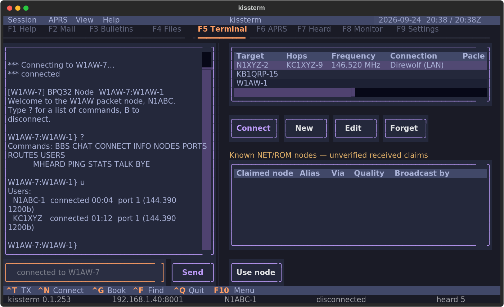

# kissterm

A terminal for packet radio that talks to your TNC directly — over a serial
cable, over Bluetooth, or over TCP/IP to a KISS TNC anywhere on your network.
No kernel AX.25 stack. No root. No Windows.


The monitor pane shows everything on the channel, and the heard list shows who
has been active and whether you heard them directly:


Every station you've connected to, or set up in advance -- `Ctrl+G` opens the
Address Book as a slide-out on the Terminal pane, and dials one directly, with
its node-hop chain, saved login and frequency reminder all still applying:



Everything the first-run wizard asks for stays editable in the app -- callsign,
transport, link timing, APRS:


**New to packet radio?** The thing that makes a node's command line
intimidating is that nothing on screen tells you what you can type. kissterm
reads the banner and prompt a node already sends and matches them against a
shipped command reference for that software -- no manual to go find, no
memorizing that one node's "bye" is another node's "B" is a third node's
"*BYE*". `Ctrl+R` shows you the actual list, for the actual node you are
actually talking to, before you have spent a single byte finding out by
guessing.

## Why this exists

Packet radio on Linux has been stuck with a hard choice: use `linpac`, which
needs the kernel AX.25 stack configured with root and cannot talk to a KISS TNC
over the network at all — or boot Windows for BPQTerminal or UZ7HO EasyTerm.

kissterm implements **AX.25 connected mode itself, in userspace, over KISS**.
That one decision is what lets it run unprivileged, on any platform, against a
TNC on a USB cable, a Bluetooth TNC in your pocket, or a Direwolf instance on a
Raspberry Pi in the garage — with nothing to configure at the OS level.

| | kissterm | linpac | BPQTerminal | EasyTerm |
|---|---|---|---|---|
| KISS over serial | yes | via kernel | yes | yes |
| KISS over TCP/IP | **yes** | no | yes | yes |
| Bluetooth TNC | yes | via kernel | no | no |
| Needs kernel AX.25 | **no** | yes | no | no |
| Needs root to set up | **no** | yes | no | no |
| Runs on Linux / macOS / BSD | **yes** | Linux | no | no |
| Terminal UI (works over SSH) | **yes** | yes | no | no |
| VARA / HF modems | in progress | no | yes | no |
| APRS decode | yes | no | no | separate app |

## Features

- **Context-aware help, so you never face a bare prompt with no idea what is
  legal.** kissterm identifies the node you connected to -- BPQ32, JNOS, a
  plain TNC2 command mode -- passively, from the banner and prompt it sends
  you anyway, never by asking it anything extra. `Ctrl+R` then shows that
  node's actual command set, with a plain-English glossary of packet jargon
  in the same pane, and picking one fills your input line without sending it.
  Connected to a real node with a local menu of its own? "Learn from node"
  asks it once, tells you what that will cost in airtime first, and caches
  the answer under that node forever -- you never pay for it twice, and
  neither does anyone else who pulls this repo, because the common command
  sets ship as data (`kissterm/nodes/data/`) rather than everyone crawling
  the same nodes from scratch. Detection is deliberately conservative: a
  wrong command set shown with confidence is worse than an honest "unknown
  node", so an unfamiliar banner just says so instead of guessing.
- **Connect to any packet node or BBS.** Full AX.25 2.2 connected mode with
  retransmission and timer recovery, so a marginal path recovers instead of
  dropping you. Modulo 128 (extended sequence numbers) is supported; modulo 8
  is the default because it is what everything on the air actually speaks.
  A connect gives up after 5 attempts rather than the spec's 10 -- retrying is
  one keystroke, while every unanswered SABM is another transmission on a
  shared channel -- but an *established* link keeps the full N2, because
  dropping a live session over a momentary fade is the expensive mistake.
  Both are settings.
- **Every transport.** KISS over serial, over TCP/IP, and over Bluetooth;
  AGWPE (Direwolf, UZ7HO SoundModem); the Linux kernel AX.25 stack if you
  already have one. VARA HF/FM and Mercury are implemented but not yet verified
  against hardware — see [docs/ROADMAP.md](docs/ROADMAP.md).
- **Telnet and SSH, for a node reachable over the Internet.** No AX.25
  framing on either wire — the remote node's own telnet or SSH server
  already ran the link layer, and the byte stream is the session the moment
  it connects, same as SyncTERM or a plain `telnet`/`ssh` client. SSH is
  password-auth only for now (see [SETUP.md](SETUP.md) §6a).
- **The network scan covers the whole subnet, and says so if it cannot.** A
  /24 across the well-known packet ports is over a thousand connection
  attempts; the first version fit about a sixth of them into its time budget,
  gave up at `.43`, and reported the result as though it had finished --
  which hid a real TNC at `.128` behind a web server at `.3`. Ports are now
  the outer loop, so a scan that does run short still touches every address
  on the likeliest port, and a truncated sweep tells you how far it got
  instead of pretending.
- **USB TNCs are noticed when you plug them in.** No rescan, no restart --
  enumerating serial ports costs 0.4 ms and touches nothing but the local
  machine, so kissterm just watches. If the TNC you are *using* gets unplugged,
  it says so instead of failing quietly later. **The network is never scanned
  automatically**: a sweep is around 1,500 connection attempts, which is fine
  when you ask for it and antisocial on a timer. A configured host that goes
  away is reconnected to by address, not rediscovered by scanning.
- **It finds your hardware.** First run enumerates serial ports, recognises the
  common TNC chipsets by USB ID, sweeps your LAN for the well-known KISS, AGWPE
  and VARA ports, and lists paired Bluetooth TNCs — then asks you to pick one.
  Getting on the air should not require reading a manual first.
- **A real monitor pane.** Every frame on the channel, decoded the way `listen`
  and BPQ show it, with filtering by callsign or payload text.
- **Heard list, with a bearing and distance to almost everyone in it.** Who
  you have heard, when, how often, by what path, and whether you heard them
  directly or through a digipeater — and once you've told kissterm where you
  are, which way to point a beam and how far for any station reporting a
  position, whether that came from an APRS beacon or an ordinary packet
  node's plain-text sign-off ("de W1AW FN31pr"). kissterm reads a grid square
  out of an everyday BTEXT/BBS banner too, not just out of APRS — a station
  never has to speak APRS at all to show up with a bearing.
- **Notices mail waiting for you, without connecting to check.** Nodes
  running the W0RLI/FBB "MAIL FOR" convention beacon the callsigns they're
  holding mail for; kissterm watches every beacon on the channel for yours in
  that list and tells you — in the log and as a notification — the moment it
  hears one, with nothing to poll and no connection spent finding out.
- **APRS.** Positions (uncompressed, compressed, and Mic-E), messages, status,
  objects, weather and telemetry — APRS is just an AX.25 UI frame, so it comes
  almost free on top of the same stack.
- **A terminal that only sends when you say so.** The conversation above is
  read-only: scroll it, select and copy from it, click a URL in it. The input
  line at the bottom is the only thing that ever transmits, and only when you
  press Enter or click Send. Suggestions fill the input; they never send it.
- **A BBS's own colour, without its escape sequences.** Remote ANSI is passed
  through an allowlist: colour, bold and underline survive, so a board that
  has painted its menus since 1988 still reads the way its sysop meant it to.
  Cursor movement, screen erase, window-title and clipboard sequences do not
  survive, whatever the setting -- an allowlist, not a denylist, because the
  set of sequences a terminal understands is undocumented in practice and the
  set that can only recolour a glyph is small enough to enumerate.
- **Session transcripts.** One plain-text file per connection: everything
  sent, everything received, every link-state change, timestamped. The
  scrollback already holds it; this is what makes it survive closing the app.
  A log that cannot be written is reported once and then never allowed to
  disturb the link.
- **A transmit switch you can see, like every other ham program.** `Ctrl+T`
  is the master gate, in the same sense as WSJT-X's Enable Tx: with it off,
  nothing keys the radio -- not a beacon, not answering a call, not the send
  line. It starts **off**, so a fresh launch cannot transmit until you say so,
  and the status bar reads `TX OFF` for as long as that is true. A station
  meant to run unattended sets `tx_armed_at_start`. Asking to connect to a
  named station (`Ctrl+N`) or to disconnect (`Ctrl+D`) **turns it on** rather
  than being refused -- naming a station and confirming it is the clearest
  way an operator can ask to transmit, and the switch exists to stop the
  transmissions you did *not* ask for. It says so when it does: a
  notification, a line in the log, and the status bar.
- **Beacons.** A short text on a timer telling the channel you are there --
  the `BTEXT` convention, sent as unproto UI frames, separate from APRS
  beaconing. Off until you turn it on, silent while the text is empty, and a
  ten-minute floor that is enforced rather than suggested. Settings shows what
  your chosen interval actually costs the channel, in seconds and as a
  percentage of the frequency. The timer waits a full interval before its
  first transmission -- **the menu's Session > Send beacon sends one right now**, the way JS8Call's
  heartbeat button does, without turning the timer on.
- **`kissterm --doctor`.** Diagnoses the things that actually go wrong: serial
  permissions, missing dependencies, an unreachable TNC host, a bad callsign.

## Install

```bash
uv tool install kissterm      # or: pipx install kissterm
kissterm
```

From source:

```bash
git clone https://github.com/bradbrownjr/kissterm
cd kissterm
python3 -m venv .venv && .venv/bin/pip install -e .
.venv/bin/kissterm
```

That `pip install -e .` creates a real executable at `.venv/bin/kissterm`.
Three equivalent ways to run it:

```bash
.venv/bin/kissterm            # the installed console script
.venv/bin/python -m kissterm  # same thing, without relying on PATH
./scripts/kissterm-dev        # wrapper: finds the venv itself, works from any directory
```

To get it on your PATH without installing system-wide:

```bash
ln -s "$(pwd)/scripts/kissterm-dev" ~/.local/bin/kissterm
```

First run asks for your callsign and then goes looking for your TNC. See
[SETUP.md](SETUP.md) for Direwolf, Bluetooth pairing, serial permissions, and
the rest.

**Nothing you answer at setup is locked in.** The Settings tab (`F5`)
edits your callsign, which TNC or modem to use, AX.25 timing (paclen, window,
T1/T2/T3, retries) and APRS beaconing -- with validation, and a note on each
field saying whether it takes effect now, on the next connection, or at
restart. "Scan for hardware" re-runs discovery from inside the app, so moving
your Direwolf host to a new IP does not mean editing a TOML file.

**"New" adds a transport a scan cannot find.** Discovery can only identify a
KISS TNC or an AGWPE engine by probing it -- it has no way to invent a VARA
modem's callsign, a Telnet host, or an SSH login nobody has typed yet. "New"
in Settings > Transports opens a form for exactly those (and a second entry
for hardware a scan already found); the fields shown change with the kind you
pick, and a Telnet/SSH/VARA/Mercury entry gets the same auto-login section
the Connect dialog has, sent right after that transport connects.

**"Test selected" asks a configured host what it actually is.** Port 8000 and
8001 are as popular with self-hosted web apps as with packet software, so a
scan that matched on port number alone would offer you a media server as a
TNC. The test settles it: an AGWPE engine is confirmed outright by its version
reply, a KISS TNC is confirmed the moment a frame arrives, and anything that
answers with an HTTP status line, an SSH banner, or a hang-up is reported as
what it is and is no longer offered by the scan at all. A port that is open
and silent stays "unconfirmed" rather than "broken" -- that is exactly what a
working KISS TNC looks like on a quiet channel, since KISS has no version
query and never greets you. Link
parameters deliberately do not change under an established link; they were
negotiated when it came up.

**Changing your callsign is never more than the menu.** Session > My callsign, or
`kissterm --callsign W1AW-9` from a shell -- neither re-runs the setup wizard.
Operators change SSID constantly (a `-1` mailbox, a different SSID for portable
or an emergency net, a club call for an event), so this is a first-class
action, not something buried in a config file. It is refused while a link is
up: the callsign is in the address field of every frame of an established
conversation, and swapping it mid-session would kill the link by timeout.

## Keys

kissterm follows the keyboard convention of Midnight Commander and DOS-era
text UIs (IBM CUA): **F1 is help, F10 is the menu, and every command is in
the menu.** Shortcuts are accelerators for the commands you use most, not
the only way in -- so there are few of them, and they are keys an ordinary
terminal can actually deliver.

| Key | Action |
|-----|--------|
| `F1` | The Help tab: keys for the tab you came from, node command lists, guides, a glossary and About. `F1` again goes back |
| `F10` | The menu: every command, grouped, with its key beside it |
| `F2`..`F9` | Terminal / APRS / Heard / Monitor, and Settings on `F9` -- shown as the key in each tab's label |
| `Ctrl+N` | Connect to a station (with a list of stations already tried) |
| `Ctrl+D` | Disconnect, or cancel a connect attempt that is still trying |
| `Ctrl+T` | Enable / disable transmit -- the master switch |
| `Ctrl+G` | Open/close the Address Book (Terminal) or contacts list (APRS) |
| `Ctrl+R` | Command reference for the node you are talking to; on APRS, the gateway services |
| `Ctrl+F` | Find in the terminal scrollback |
| `Ctrl+L` | Clear the active log |
| `Ctrl+Q` | Quit |
| `Ctrl+P` | Search every command by name, including those with no key |

Inside a list -- the Address Book, APRS contacts -- `Enter` is the default
action, `Insert` adds, `E` edits and `Delete` forgets, and those keys appear
in the bottom bar while the list has focus.

Everything else is in the **F10 menu**: send a beacon, send a position
report, objects, bulletins, gateway forms, Watch APRS-IS, the SSID filter,
file transfer, the NET/ROM panel, your callsign and saved transcripts. Open
it, then press the underlined letter; Left and Right move between headings.
A command that cannot run right now is listed anyway, dimmed, with the
reason.

**The bottom bar shows the keys that work on this tab, right now**, as many
as fit the terminal width, with `F10 Menu` always at the right-hand end.
Nothing is ever unreachable at a narrow width: the menu and `Ctrl+P` reach
everything, and every key in the bar can also be clicked.

**If `F1` or `F10` does nothing**, your terminal program took it first --
GNOME Terminal opens its own help on `F1` and its menu bar on `F10` until
you turn off "Enable the menu accelerator key" in its preferences. Clicking
the Help tab, or Menu in the bottom bar, works regardless.

**The Help tab is written for someone new to packet.** Its *Guides* walk
through getting on the air, a first connection, the transmit switch, reading
a failed connect, APRS messaging and sharing the channel. *Node commands*
lists what each common node type understands, without connecting to one or
spending airtime asking it. *About* shows the version and where your config
and logs are, for a bug report.

Connect targets accept a digipeater path: `WS1EC-7 via W1AW-1,W1XYZ`.

**The connect dialog remembers where you have been.** `WS1EC-15` and `WS1EC-7`
are different services on one machine, and a mistyped SSID fails in a way that
looks exactly like a bad RF path -- so every target you confirm is kept.
Typing narrows the list, Down moves into it, Enter connects, and Delete
forgets a row for good. Stations are recorded on the *attempt*, not on
success: the connect that got no answer is the one you are about to try
again. Each row shows whether it has ever actually come up, so "five attempts,
never connected" stays visible instead of being flattened into a bare list.
The list lives in `addressbook.json` in your data directory, not in
`config.toml` -- it is history, not settings, and nothing should rewrite a
file you hand-edit.

**If you have more than one transport of the same kind configured, the
Connect dialog can switch between them before dialing** -- two KISS TNCs, or
two Telnet/SSH hosts. With only one configured (the usual case) there is no
dropdown to get in the way; with two or more, it defaults to whichever is
active and switches live if you pick a different one. Switching TIERS this
way -- a frame-tier KISS TNC to a session-tier Telnet/SSH/VARA host, or back
-- is not supported live; Settings (`F5`) > Transports still needs a restart
for that.

**The Address Book slide-out (`Ctrl+G`, from the Terminal pane) is the same
list, with room to manage it.** A table of every saved station -- add one in
advance, fix a typo in its hop chain, or dial it directly (Enter or the
Connect button) without opening Ctrl+N first. Insert/E/Delete match
`syncterm`'s dialing directory; Escape closes the panel again.
An entry can carry:
- a **node-to-node hop chain**, for a station reached only by connecting
  through intermediate BPQ/NET-ROM nodes in turn -- no digipeater path
  exists, so kissterm connects to the first node and sends `C <node>` over
  that link for each remaining hop, waiting for its own CONNECTED reply
  before the next;
- a **saved credential** (managed in Settings > Credentials) or a **saved
  script** (Settings > Scripts) instead of its own typed-out login, looked
  up fresh every connect so changing one updates every station that points
  at it. The two are kept as separate lists on purpose: a credential is a
  login, named for the account it belongs to; a script is any sequence of
  commands sent after connecting -- a login followed by a node hop, a
  mailbox check, whatever you do after every connect to some station --
  named for what it does. A credential wins if both happen to be set;
- a **frequency and connection type**, purely informational -- kissterm
  cannot tune a radio or start a modem for you, but it will ask you to
  confirm both are set before a connect that has them on file goes out.
  Connection type picks from whatever you've already set up in
  Settings (`F5`) > Transports (a TCP KISS TNC, VARA HF, a Telnet or SSH
  node, ...), so it's a reminder that matches what you actually have
  configured rather than a note you have to retype consistently by hand.

**BBS mail helpers** are in `Ctrl+R` > **BBS mail helpers**. They provide
dialect-specific starting commands for listing mail, reading a numbered
message, and starting a message to a callsign; their displayed confidence tells
you how much verification backs each command. Choosing one only puts
the command in the terminal compose box; inspect it and press Enter or Send to
transmit. This is intentionally not a BBS-output parser: prompt and message
formats vary too much between systems for a rigid parser to be trustworthy.
Typing a command prefix also shows a stacked, Tab-to-fill explanation -- for
example, `LM - List Mine` and `LB - List Bulletins` -- rather than squeezing
the descriptions off the right edge of a narrow terminal. Up/Down selects a
candidate; Tab fills the selected command without sending it.
The BBS helper also shows `B - BYE — disconnect from BBS`; typing `BYE` finds
that short command and Tab fills `B`.
BPQMail list filters are described too: `LD` delivered, `LF` forwarded, `LH`
held, `LK` killed, and `LL n` the last *n* messages. Parameterized entries
(`LL`, `R`, and `SP`) also remain visible in autocomplete with their published
meaning; Tab fills only the command text, leaving its number or callsign for
you to supply.

**Running under tmux or screen?** Nothing needs configuring. kissterm
deliberately binds no key that a multiplexer eats or that needs an enhanced
keyboard protocol to tell apart -- no `Ctrl+B` (tmux's prefix), no
`Ctrl+Shift+` anything, no `Ctrl+Alt+` anything.

**Ctrl+D is Disconnect, and still deletes a character.** Textual's text
fields bind plain `Ctrl+D` to delete-the-character-right. kissterm claims the
key only while there is a session to end, so it disconnects when that is what
it could mean and deletes a character when it is not -- and `Delete` always
deletes.

## Command line

```
kissterm                     launch
kissterm --doctor            run diagnostics and exit
kissterm --discover          scan for TNCs and modems, print, exit
kissterm --callsign W1AW-1   set your callsign and exit (no wizard)
kissterm --setup             re-run the first-run wizard
kissterm --transport NAME    open a specific configured transport
kissterm --connect WS1EC-7   connect once the app is up
kissterm --log-level debug   record every frame, both directions, to a file
```

## When a connection does not come up

Packet links fail for two completely different reasons and they need opposite
responses, so kissterm never reports them with the same words:

- **`connection refused (DM)`** -- the far end heard you and said no. Your
  signal is getting there. Check the callsign and SSID, and whether that node
  accepts connections from you.
- **`no answer from <call> after N tries`** -- nothing came back at all. That
  is an antenna, power, squelch or propagation problem, not a configuration
  one. kissterm sends 6 SABMs over about 18 seconds before saying this;
  `connect_retries` in Settings (F9) changes that.

The **Monitor tab (F5)** is the real instrument. It shows every frame in both
directions, `>` for what you transmitted and `<` for what was heard, so you
can see your SABM leave and watch for a reply -- including supervisory
frames (RR, RNR, REJ), shown by default because on an ordinary one-to-one
link an RR coming back is exactly the "did they get it" answer. On a busy
multi-station link they can be most of the traffic and almost none of the
information; the filter bar's **Supervisory** button (its label shows which
state it's in) turns them back off for that case.

**If you send a line and nothing comes back, kissterm says so.** Fifteen
seconds after a send with no reply since, and only once the far end has
actually acknowledged it at the AX.25 layer, a note appears: `<call>
acknowledged that -- no reply yet`. That distinguishes "the link is fine and
the node is just slow or silent" from "this never reached them" -- the two
used to look identical unless you already knew to check the Monitor tab for
a bare RR.

For a record you can read afterwards or send to someone else:

```
kissterm --log-level debug
```

writes every frame, every T1 expiry with its retry count, and every link state
transition to `~/.local/state/kissterm/logs/kissterm.log` (macOS:
`~/Library/Application Support/kissterm/logs/`). It looks like this:

```
TX port 0: KC1JMH>WS1EC-15 SABM P cmd
T1 expiry 1 in connecting, rc=0 of 10
TX port 0: KC1JMH>WS1EC-15 SABM P cmd
state -> <AX25Link KC1JMH>WS1EC-15 failed V(S)=0 V(R)=0 V(A)=0>
```

A frame the transmit gate suppressed is logged as `TX BLOCKED` and never as
sent -- if `TX OFF` is showing in the status bar, the log says so rather than
claiming you transmitted.

## Clock

Local time, UTC time and the date are three **independent** toggles -- show
any combination, including none at all. Local time is on by default. Showing
both times side by side is a real operating mode: amateur radio runs on UTC
while you live in local time, and doing that arithmetic mid-net is how a log
ends up an hour wrong. 12- or 24-hour (24 by default, the amateur convention).

UTC is always marked (`Z` on a 24-hour clock, `UTC` on a 12-hour one); local
time is unmarked, the same convention a paper log uses. Dates are ISO 8601
(`2026-09-05`), never locale order -- `03/04` is March 4th to an American
operator and April 3rd to nearly everyone else, and packet is international.
On the nights the local and UTC dates disagree, each reading carries its own
date rather than one covering both.

Set it in Settings (`F5`) under Clock, or in `config.toml`
(`show_local_time`, `show_utc_time`, `clock_24h`, `show_date`).

## Themes

Every color in kissterm is a theme variable, so switching repaints the whole
app instantly -- nothing to restart. Pick one in Settings (`F5`), set
`theme = "..."` in `config.toml`, or answer the wizard's theme prompt on first
run. Default is **Tokyo Night**.

Twenty-one built-in options across Tokyo Night, Catppuccin (Latte/Frappe/
Macchiato/Mocha), Nord, Gruvbox, Dracula, Monokai, Solarized, Rose Pine, Atom
One, Textual's own light/dark, and `ansi-dark`/`ansi-light` -- the last two
render using your **terminal emulator's own** 16-color palette, which is the
truest way to sync with an external terminal theme: there is no separate
palette to keep matched by hand.

Some well-known dark themes (Tokyo Night, Nord, Gruvbox, Dracula, Monokai)
have no official light counterpart upstream, so kissterm does not invent one.
`catppuccin-latte`, `rose-pine-dawn`, or `ansi-light` are close relatives if
you want a light mode.

For an exact hex match to a theme kissterm doesn't ship, `theme = "custom"`
reads a `[custom_theme]` table from `config.toml` -- one hex value per color,
meant for an external theme-sync tool or values copied out of a terminal
emulator's own color-scheme file. See `config.toml.example`.

A theme name that no longer resolves falls back to Tokyo Night with a logged
warning rather than leaving the app unstyled or refusing to start.

## Safety notes

**kissterm starts unable to transmit.** `Ctrl+T` is the master gate and it is
closed on launch -- the same convention WSJT-X uses, for the same reason. It is
enforced in `FrameTransport.send_frame` and `Session.send`, the one place every
frame and every byte passes through, so it holds for the state machine, a
background timer, and any backend written later; the checks in the panes exist
only to tell you *why* nothing happened. A blocked transmission is counted, not
raised, because AX.25 retransmission runs on timer callbacks where an exception
has nowhere to go.

Two keys are exempt, and only these two: `Ctrl+N` and `Ctrl+D`. Naming a
station in the connect dialog and confirming it is an unambiguous request to
key the radio, so it opens the gate instead of hitting a refusal that cannot
be acted on. Disconnecting is the same, and skipping the DISC would leave the
far station holding a session open until its own timers expire. Both announce
it. Nothing that lacks a confirmation step and a named target does this --
the menu's Send beacon still reports the closed gate and sends
nothing.

The two things that can transmit without you at the keyboard -- answering a
call, and beaconing -- are additionally off on a fresh install, both say so in
the status bar (`ANSWERING`, `BEACON`) for as long as they are armed, and both
write every transmission into the terminal pane where you can see it happened.
A beacon that the gate suppressed is reported as not sent, never as sent.

**It does not answer calls from other stations unless you turn that on** -- answering is unattended
transmission under your callsign, and a fresh install must not start doing that
on its own. With it off, a station calling you gets a polite refusal (a DM) and
stops retrying rather than transmitting into silence. With it on, the status
bar says `ANSWERING` for as long as that is true, and callers get a banner you
configure. Automatic-control rules differ by country and band; check what your
licence allows before enabling it.

**Nothing in discovery or the connection test can key your rig.** All either
writes to a socket is two bare `FEND` bytes -- a KISS frame with no type byte,
so there is no command for a TNC to act on -- or an AGWPE version query, which
asks the software a question. VARA's ports are never spoken to at all, because
its command channel takes line commands that could start a session. The exact
bytes are asserted on the wire in `tests/unit/test_identify_tcp.py`.

A beacon is unattended transmission under your callsign onto a channel
everybody shares, so the interval floor is a clamp in code rather than advice
in a help string, and an empty beacon is never sent -- `MAIL FOR:` with
nothing after it is pure channel occupancy.

Text arriving from a remote node is treated as untrusted. Colour, bold and
underline may survive (turn that off with `remote_color = false`); everything
else -- cursor movement, screen erase, scroll regions, window title, clipboard
writes, terminal hyperlinks, DCS, and the query sequences whose replies a
shell later reads as keystrokes -- is removed, and is removed whatever that
setting says. A corrupt frame off a noisy channel produces the same bytes as a
malicious one, and neither should be able to repaint your screen in the middle
of a net. Transcripts get the fully stripped text, because `cat` on a log file
would run whatever escapes it contained.

## Status

Version 0.1. The AX.25 stack, the KISS transports, the monitor, the heard list,
APRS decoding, beacons and session transcripts are implemented and tested. VARA, Mercury and BLE TNCs are
not yet verified against hardware. See [docs/ROADMAP.md](docs/ROADMAP.md) for
what is open and [docs/CHANGELOG.md](docs/CHANGELOG.md) for what has changed.

Bug reports are much more useful with `kissterm --doctor` output attached.

## Development

[AGENTS.md](AGENTS.md) is the engineering document and
[DESIGN.md](DESIGN.md) is the visual and interaction schema — read both before
changing anything. Each package also has its own short contract file
(`kissterm/ax25/AGENTS.md`, `kissterm/transport/AGENTS.md`, and so on) so a
single-file change does not require reading the whole repo.

For any wire-format or RF-behaviour change, start with the cited
[protocol guide](docs/PROTOCOL_GUIDE.md). It distinguishes the AX.25, KISS,
and APRS layers and identifies the primary specifications rather than treating
existing code or another client as the authority.

```bash
.venv/bin/pip install -e ".[dev]"
git config core.hooksPath hooks     # once per clone: version bump + dep resync
.venv/bin/python -m pytest -q
```

The AX.25 stack is tested against a software loopback with injectable frame
loss (`tests/loopback.py`), so the link layer — including retransmission and
timer recovery — is exercised without a radio.

## License

MIT. See [LICENSE](LICENSE).

Portions of this project were developed with AI assistance (Claude).

## Author

Brad Brown Jr — [github.com/bradbrownjr](https://github.com/bradbrownjr)
