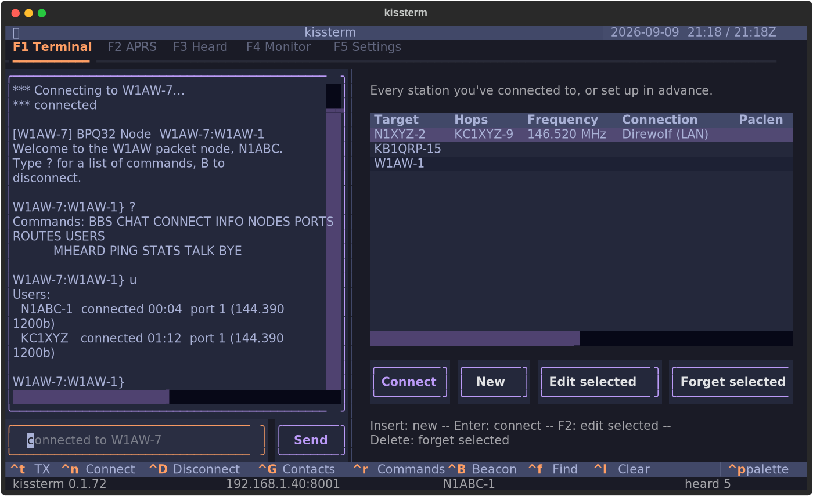
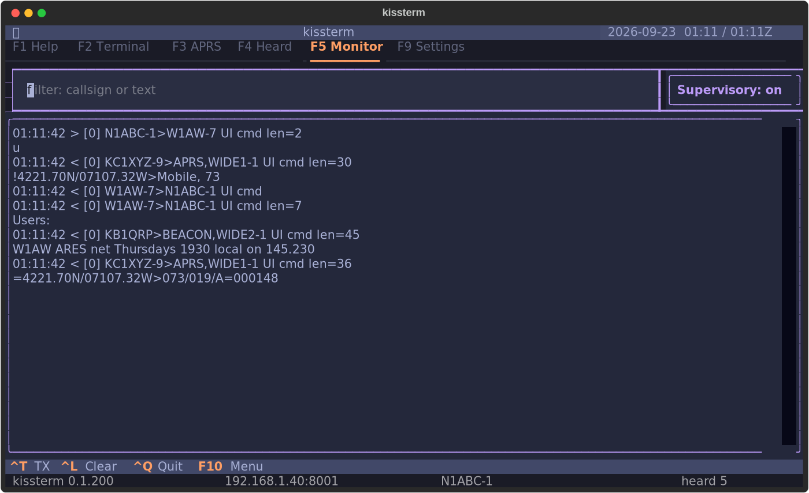
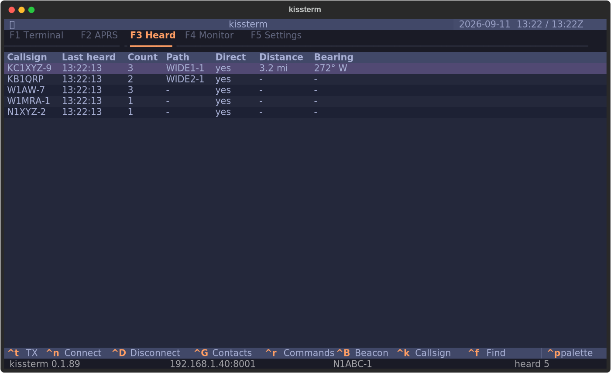
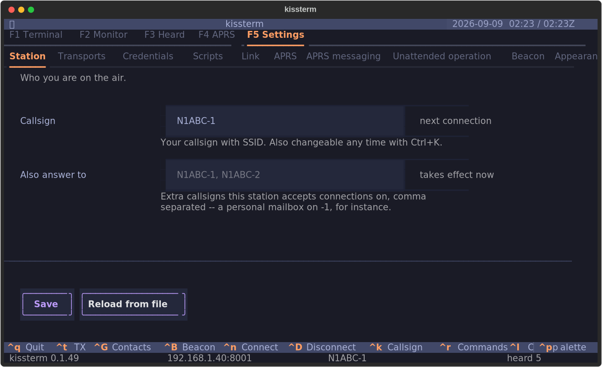

# kissterm

A terminal for packet radio that talks to your TNC directly — over a serial
cable, over Bluetooth, or over TCP/IP to a KISS TNC anywhere on your network.
No kernel AX.25 stack. No root. No Windows.



The monitor pane shows everything on the channel, and the heard list shows who
has been active and whether you heard them directly:





Everything the first-run wizard asks for stays editable in the app -- callsign,
transport, link timing, APRS:



## Why this exists

Packet radio on Linux has been stuck with a hard choice: use `linpac`, which
needs the kernel AX.25 stack configured with root and cannot talk to a KISS TNC
over the network at all — or boot Windows for BPQTerminal or UZ7HO EasyTerm.

kissterm implements **AX.25 connected mode itself, in userspace, over KISS**.
That one decision is what lets it run unprivileged, on any platform, against a
TNC on a USB cable, a Bluetooth TNC in your pocket, or a Direwolf instance on a
Raspberry Pi in the garage — with nothing to configure at the OS level.

| | kissterm | linpac | BPQTerminal | EasyTerm |
|---|---|---|---|---|
| KISS over serial | yes | via kernel | yes | yes |
| KISS over TCP/IP | **yes** | no | yes | yes |
| Bluetooth TNC | yes | via kernel | no | no |
| Needs kernel AX.25 | **no** | yes | no | no |
| Needs root to set up | **no** | yes | no | no |
| Runs on Linux / macOS / BSD | **yes** | Linux | no | no |
| Terminal UI (works over SSH) | **yes** | yes | no | no |
| VARA / HF modems | in progress | no | yes | no |
| APRS decode | yes | no | no | separate app |

## Features

- **Connect to any packet node or BBS.** Full AX.25 2.2 connected mode with
  retransmission and timer recovery, so a marginal path recovers instead of
  dropping you. Modulo 128 (extended sequence numbers) is supported; modulo 8
  is the default because it is what everything on the air actually speaks.
  A connect gives up after 5 attempts rather than the spec's 10 -- retrying is
  one keystroke, while every unanswered SABM is another transmission on a
  shared channel -- but an *established* link keeps the full N2, because
  dropping a live session over a momentary fade is the expensive mistake.
  Both are settings.
- **Every transport.** KISS over serial, over TCP/IP, and over Bluetooth;
  AGWPE (Direwolf, UZ7HO SoundModem); the Linux kernel AX.25 stack if you
  already have one. VARA HF/FM and Mercury are implemented but not yet verified
  against hardware — see [docs/ROADMAP.md](docs/ROADMAP.md).
- **USB TNCs are noticed when you plug them in.** No rescan, no restart --
  enumerating serial ports costs 0.4 ms and touches nothing but the local
  machine, so kissterm just watches. If the TNC you are *using* gets unplugged,
  it says so instead of failing quietly later. **The network is never scanned
  automatically**: a sweep is around 1,500 connection attempts, which is fine
  when you ask for it and antisocial on a timer. A configured host that goes
  away is reconnected to by address, not rediscovered by scanning.
- **It finds your hardware.** First run enumerates serial ports, recognises the
  common TNC chipsets by USB ID, sweeps your LAN for the well-known KISS, AGWPE
  and VARA ports, and lists paired Bluetooth TNCs — then asks you to pick one.
  Getting on the air should not require reading a manual first.
- **A real monitor pane.** Every frame on the channel, decoded the way `listen`
  and BPQ show it, with filtering by callsign or payload text.
- **Heard list.** Who you have heard, when, how often, by what path, and
  whether you heard them directly or through a digipeater.
- **APRS.** Positions (uncompressed, compressed, and Mic-E), messages, status,
  objects, weather and telemetry — APRS is just an AX.25 UI frame, so it comes
  almost free on top of the same stack.
- **Command references built in.** kissterm ships the command sets for common
  node software and TNCs and identifies the node from its banner, so `F6` shows
  you what you can type before you have spent a byte. It does **not** ask the
  node for its own help text unless you tell it to: at 1200 baud half-duplex
  that is around 19 seconds of channel per 2 KB, and over a minute for a
  verbose node -- time nobody else on the frequency can transmit.
- **A terminal that only sends when you say so.** The conversation above is
  read-only: scroll it, select and copy from it, click a URL in it. The input
  line at the bottom is the only thing that ever transmits, and only when you
  press Enter or click Send. Suggestions fill the input; they never send it.
- **A BBS's own colour, without its escape sequences.** Remote ANSI is passed
  through an allowlist: colour, bold and underline survive, so a board that
  has painted its menus since 1988 still reads the way its sysop meant it to.
  Cursor movement, screen erase, window-title and clipboard sequences do not
  survive, whatever the setting -- an allowlist, not a denylist, because the
  set of sequences a terminal understands is undocumented in practice and the
  set that can only recolour a glyph is small enough to enumerate.
- **Session transcripts.** One plain-text file per connection: everything
  sent, everything received, every link-state change, timestamped. The
  scrollback already holds it; this is what makes it survive closing the app.
  A log that cannot be written is reported once and then never allowed to
  disturb the link.
- **A transmit switch you can see, like every other ham program.** `Ctrl+T`
  is the master gate, in the same sense as WSJT-X's Enable Tx: with it off,
  nothing keys the radio -- not a beacon, not answering a call, not the send
  line. It starts **off**, so a fresh launch cannot transmit until you say so,
  and the status bar reads `TX OFF` for as long as that is true. A station
  meant to run unattended sets `tx_armed_at_start`. Asking to connect to a
  named station (`Ctrl+N`) or to disconnect (`Ctrl+D`) **turns it on** rather
  than being refused -- naming a station and confirming it is the clearest
  way an operator can ask to transmit, and the switch exists to stop the
  transmissions you did *not* ask for. It says so when it does: a
  notification, a line in the log, and the status bar.
- **Beacons.** A short text on a timer telling the channel you are there --
  the `BTEXT` convention, sent as unproto UI frames, separate from APRS
  beaconing. Off until you turn it on, silent while the text is empty, and a
  ten-minute floor that is enforced rather than suggested. Settings shows what
  your chosen interval actually costs the channel, in seconds and as a
  percentage of the frequency. The timer waits a full interval before its
  first transmission -- **`Ctrl+Shift+B` sends one right now**, the way JS8Call's
  heartbeat button does, without turning the timer on.
- **`kissterm --doctor`.** Diagnoses the things that actually go wrong: serial
  permissions, missing dependencies, an unreachable TNC host, a bad callsign.

## Install

```bash
uv tool install kissterm      # or: pipx install kissterm
kissterm
```

From source:

```bash
git clone https://github.com/bradbrownjr/kissterm
cd kissterm
python3 -m venv .venv && .venv/bin/pip install -e .
.venv/bin/kissterm
```

That `pip install -e .` creates a real executable at `.venv/bin/kissterm`.
Three equivalent ways to run it:

```bash
.venv/bin/kissterm            # the installed console script
.venv/bin/python -m kissterm  # same thing, without relying on PATH
./scripts/kissterm-dev        # wrapper: finds the venv itself, works from any directory
```

To get it on your PATH without installing system-wide:

```bash
ln -s "$(pwd)/scripts/kissterm-dev" ~/.local/bin/kissterm
```

First run asks for your callsign and then goes looking for your TNC. See
[SETUP.md](SETUP.md) for Direwolf, Bluetooth pairing, serial permissions, and
the rest.

**Nothing you answer at setup is locked in.** The Settings tab (`F5`)
edits your callsign, which TNC or modem to use, AX.25 timing (paclen, window,
T1/T2/T3, retries) and APRS beaconing -- with validation, and a note on each
field saying whether it takes effect now, on the next connection, or at
restart. "Scan for hardware" re-runs discovery from inside the app, so moving
your Direwolf host to a new IP does not mean editing a TOML file. Link
parameters deliberately do not change under an established link; they were
negotiated when it came up.

**Changing your callsign specifically takes one keystroke.** `Ctrl+K` in the app, or
`kissterm --callsign W1AW-9` from a shell -- neither re-runs the setup wizard.
Operators change SSID constantly (a `-1` mailbox, a different SSID for portable
or an emergency net, a club call for an event), so this is a first-class
action, not something buried in a config file. It is refused while a link is
up: the callsign is in the address field of every frame of an established
conversation, and swapping it mid-session would kill the link by timeout.

## Keys

| Key | Action |
|-----|--------|
| `F1`..`F5` | Terminal / Monitor / Heard / APRS / Settings -- shown as the key right in each tab's label (also `Ctrl+1`..`Ctrl+5`, for a terminal that intercepts function keys) |
| `F6` | Command reference for the detected node |
| `Ctrl+T` | Enable / disable transmit -- the master switch |
| `Ctrl+Shift+B` | Send one beacon now (see the tmux note below) |
| `Ctrl+N` | Connect to a station |
| `Ctrl+D` | Disconnect |
| `Ctrl+K` | Change your callsign |
| `Ctrl+L` | Clear the active log |
| `Ctrl+Q` | Quit |

Connect targets accept a digipeater path: `WS1EC-7 via W1AW-1,W1XYZ`.

**Running under tmux or screen?** The beacon is `Ctrl+Shift+B` rather than
`Ctrl+B` because `Ctrl+B` is tmux's default prefix -- the multiplexer eats it
and kissterm never sees the keypress. Telling the two apart requires the
terminal's enhanced keyboard protocol; if `Ctrl+Shift+B` does nothing inside
tmux, add this to `~/.tmux.conf` and start a fresh server:

```
set -s extended-keys on
set -as terminal-features 'xterm*:extkeys'
```

Outside a multiplexer, plain `Ctrl+B` still beacons, so a terminal that cannot
distinguish the two keys at all is not left without the shortcut.

## Command line

```
kissterm                     launch
kissterm --doctor            run diagnostics and exit
kissterm --discover          scan for TNCs and modems, print, exit
kissterm --callsign W1AW-1   set your callsign and exit (no wizard)
kissterm --setup             re-run the first-run wizard
kissterm --transport NAME    open a specific configured transport
kissterm --connect WS1EC-7   connect once the app is up
kissterm --log-level debug   record every frame, both directions, to a file
```

## When a connection does not come up

Packet links fail for two completely different reasons and they need opposite
responses, so kissterm never reports them with the same words:

- **`connection refused (DM)`** -- the far end heard you and said no. Your
  signal is getting there. Check the callsign and SSID, and whether that node
  accepts connections from you.
- **`no answer from <call> after N tries`** -- nothing came back at all. That
  is an antenna, power, squelch or propagation problem, not a configuration
  one. kissterm sends 6 SABMs over about 18 seconds before saying this;
  `connect_retries` in Settings (F5) changes that.

The **Monitor tab (F2)** is the real instrument. It shows every frame in both
directions, `>` for what you transmitted and `<` for what was heard, so you
can see your SABM leave and watch for a reply. Supervisory frames (RR, RNR,
REJ) are hidden by default because they are most of the traffic on a busy
link and almost none of the information -- press **Supervisory** in the filter
bar to show them when you are diagnosing retries.

For a record you can read afterwards or send to someone else:

```
kissterm --log-level debug
```

writes every frame, every T1 expiry with its retry count, and every link state
transition to `~/.local/state/kissterm/logs/kissterm.log` (macOS:
`~/Library/Application Support/kissterm/logs/`). It looks like this:

```
TX port 0: KC1JMH>WS1EC-15 SABM P cmd
T1 expiry 1 in connecting, rc=0 of 10
TX port 0: KC1JMH>WS1EC-15 SABM P cmd
state -> <AX25Link KC1JMH>WS1EC-15 failed V(S)=0 V(R)=0 V(A)=0>
```

A frame the transmit gate suppressed is logged as `TX BLOCKED` and never as
sent -- if `TX OFF` is showing in the status bar, the log says so rather than
claiming you transmitted.

## Clock

Local time, UTC time and the date are three **independent** toggles -- show
any combination, including none at all. Local time is on by default. Showing
both times side by side is a real operating mode: amateur radio runs on UTC
while you live in local time, and doing that arithmetic mid-net is how a log
ends up an hour wrong. 12- or 24-hour (24 by default, the amateur convention).

UTC is always marked (`Z` on a 24-hour clock, `UTC` on a 12-hour one); local
time is unmarked, the same convention a paper log uses. Dates are ISO 8601
(`2026-09-05`), never locale order -- `03/04` is March 4th to an American
operator and April 3rd to nearly everyone else, and packet is international.
On the nights the local and UTC dates disagree, each reading carries its own
date rather than one covering both.

Set it in Settings (`F5`) under Clock, or in `config.toml`
(`show_local_time`, `show_utc_time`, `clock_24h`, `show_date`).

## Themes

Every color in kissterm is a theme variable, so switching repaints the whole
app instantly -- nothing to restart. Pick one in Settings (`F5`), set
`theme = "..."` in `config.toml`, or answer the wizard's theme prompt on first
run. Default is **Tokyo Night**.

Twenty-one built-in options across Tokyo Night, Catppuccin (Latte/Frappe/
Macchiato/Mocha), Nord, Gruvbox, Dracula, Monokai, Solarized, Rose Pine, Atom
One, Textual's own light/dark, and `ansi-dark`/`ansi-light` -- the last two
render using your **terminal emulator's own** 16-color palette, which is the
truest way to sync with an external terminal theme: there is no separate
palette to keep matched by hand.

Some well-known dark themes (Tokyo Night, Nord, Gruvbox, Dracula, Monokai)
have no official light counterpart upstream, so kissterm does not invent one.
`catppuccin-latte`, `rose-pine-dawn`, or `ansi-light` are close relatives if
you want a light mode.

For an exact hex match to a theme kissterm doesn't ship, `theme = "custom"`
reads a `[custom_theme]` table from `config.toml` -- one hex value per color,
meant for an external theme-sync tool or values copied out of a terminal
emulator's own color-scheme file. See `config.toml.example`.

A theme name that no longer resolves falls back to Tokyo Night with a logged
warning rather than leaving the app unstyled or refusing to start.

## Safety notes

**kissterm starts unable to transmit.** `Ctrl+T` is the master gate and it is
closed on launch -- the same convention WSJT-X uses, for the same reason. It is
enforced in `FrameTransport.send_frame` and `Session.send`, the one place every
frame and every byte passes through, so it holds for the state machine, a
background timer, and any backend written later; the checks in the panes exist
only to tell you *why* nothing happened. A blocked transmission is counted, not
raised, because AX.25 retransmission runs on timer callbacks where an exception
has nowhere to go.

Two keys are exempt, and only these two: `Ctrl+N` and `Ctrl+D`. Naming a
station in the connect dialog and confirming it is an unambiguous request to
key the radio, so it opens the gate instead of hitting a refusal that cannot
be acted on. Disconnecting is the same, and skipping the DISC would leave the
far station holding a session open until its own timers expire. Both announce
it. Nothing that lacks a confirmation step and a named target does this --
the manual beacon on `Ctrl+Shift+B` still reports the closed gate and sends
nothing.

The two things that can transmit without you at the keyboard -- answering a
call, and beaconing -- are additionally off on a fresh install, both say so in
the status bar (`ANSWERING`, `BEACON`) for as long as they are armed, and both
write every transmission into the terminal pane where you can see it happened.
A beacon that the gate suppressed is reported as not sent, never as sent.

**It does not answer calls from other stations unless you turn that on** -- answering is unattended
transmission under your callsign, and a fresh install must not start doing that
on its own. With it off, a station calling you gets a polite refusal (a DM) and
stops retrying rather than transmitting into silence. With it on, the status
bar says `ANSWERING` for as long as that is true, and callers get a banner you
configure. Automatic-control rules differ by country and band; check what your
licence allows before enabling it. Discovery and probing
listen only — nothing in the scan will key your rig.

A beacon is unattended transmission under your callsign onto a channel
everybody shares, so the interval floor is a clamp in code rather than advice
in a help string, and an empty beacon is never sent -- `MAIL FOR:` with
nothing after it is pure channel occupancy.

Text arriving from a remote node is treated as untrusted. Colour, bold and
underline may survive (turn that off with `remote_color = false`); everything
else -- cursor movement, screen erase, scroll regions, window title, clipboard
writes, terminal hyperlinks, DCS, and the query sequences whose replies a
shell later reads as keystrokes -- is removed, and is removed whatever that
setting says. A corrupt frame off a noisy channel produces the same bytes as a
malicious one, and neither should be able to repaint your screen in the middle
of a net. Transcripts get the fully stripped text, because `cat` on a log file
would run whatever escapes it contained.

## Status

Version 0.1. The AX.25 stack, the KISS transports, the monitor, the heard list,
APRS decoding, beacons and session transcripts are implemented and tested. VARA, Mercury and BLE TNCs are
not yet verified against hardware. See [docs/ROADMAP.md](docs/ROADMAP.md) for
what is open and [docs/CHANGELOG.md](docs/CHANGELOG.md) for what has changed.

Bug reports are much more useful with `kissterm --doctor` output attached.

## Development

[AGENTS.md](AGENTS.md) is the engineering document and
[DESIGN.md](DESIGN.md) is the visual and interaction schema — read both before
changing anything. Each package also has its own short contract file
(`kissterm/ax25/AGENTS.md`, `kissterm/transport/AGENTS.md`, and so on) so a
single-file change does not require reading the whole repo.

```bash
.venv/bin/pip install -e ".[dev]"
git config core.hooksPath hooks     # once per clone: version bump + dep resync
.venv/bin/python -m pytest -q
```

The AX.25 stack is tested against a software loopback with injectable frame
loss (`tests/loopback.py`), so the link layer — including retransmission and
timer recovery — is exercised without a radio.

## License

MIT. See [LICENSE](LICENSE).

Portions of this project were developed with AI assistance (Claude).

## Author

Brad Brown Jr — [github.com/bradbrownjr](https://github.com/bradbrownjr)
