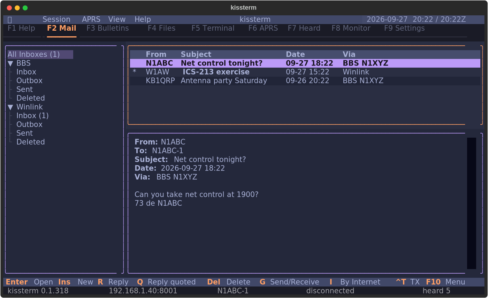
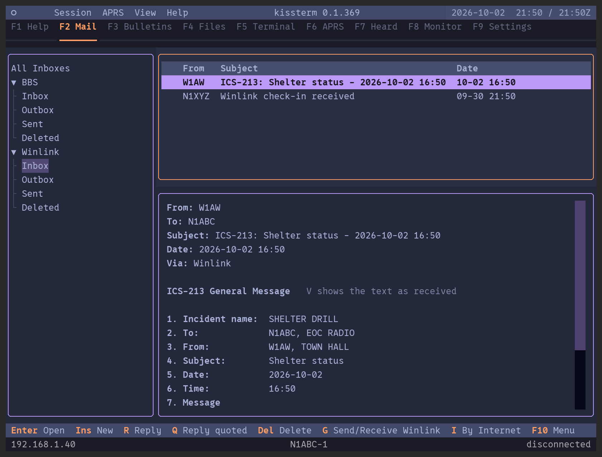
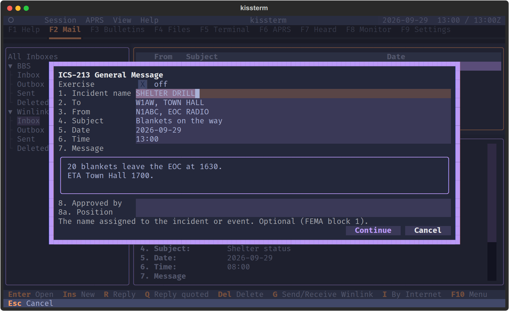
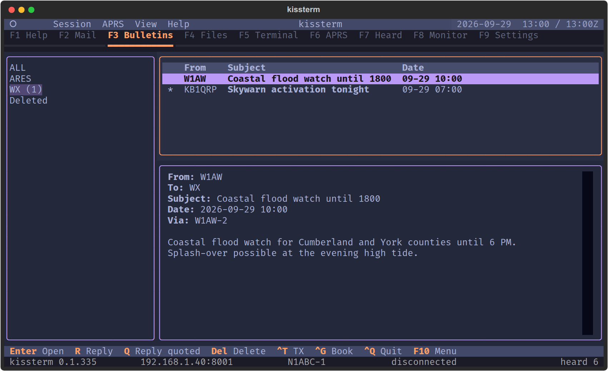
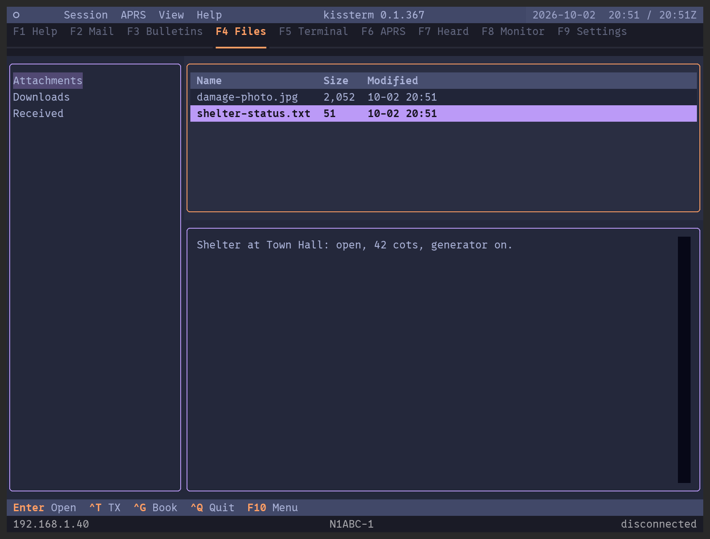
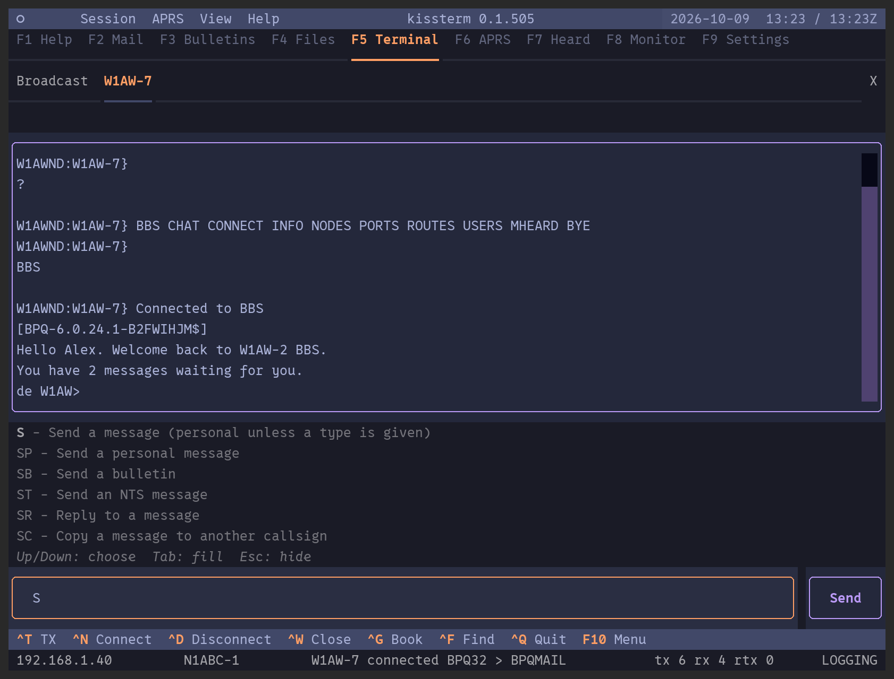
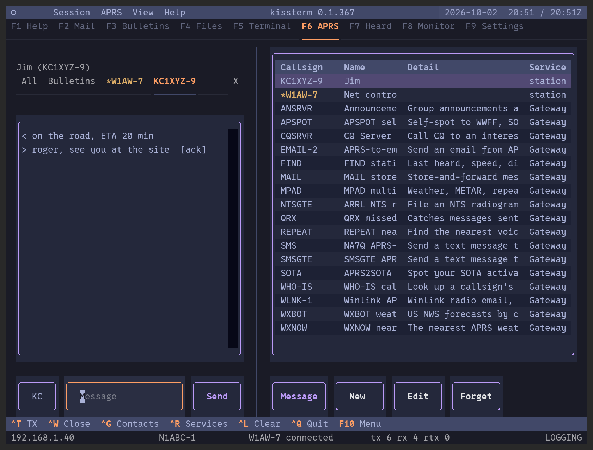
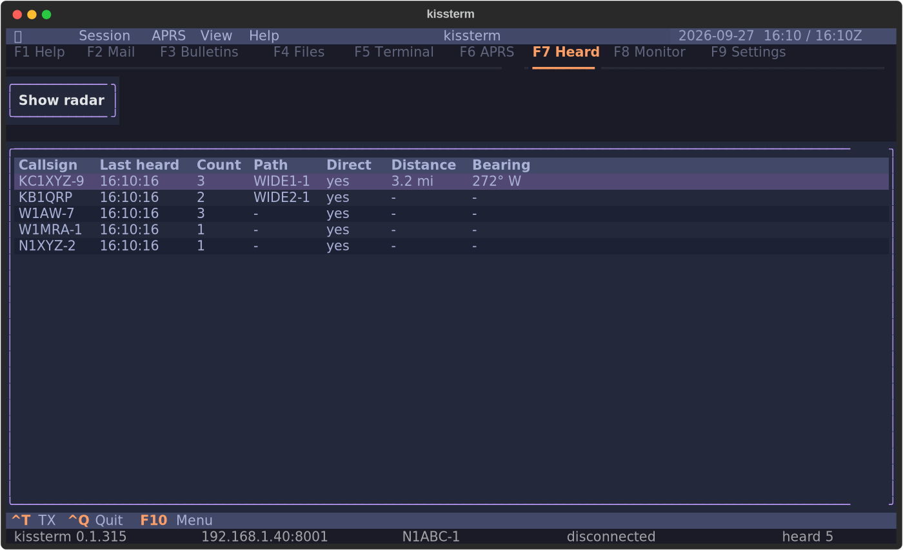
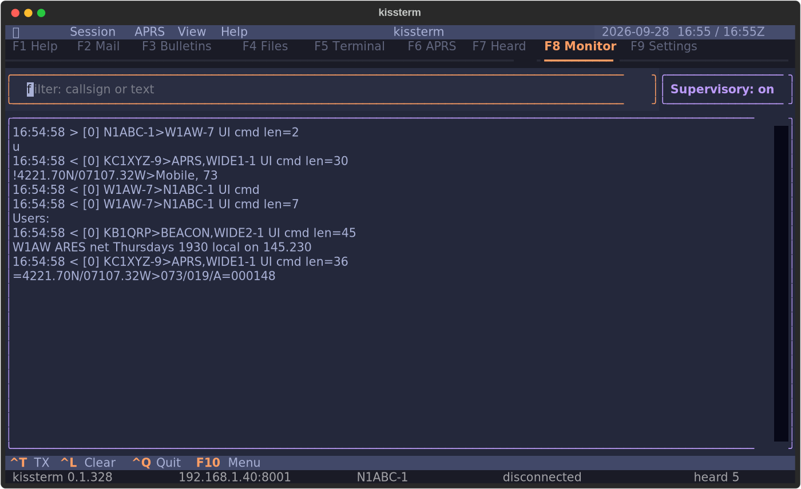
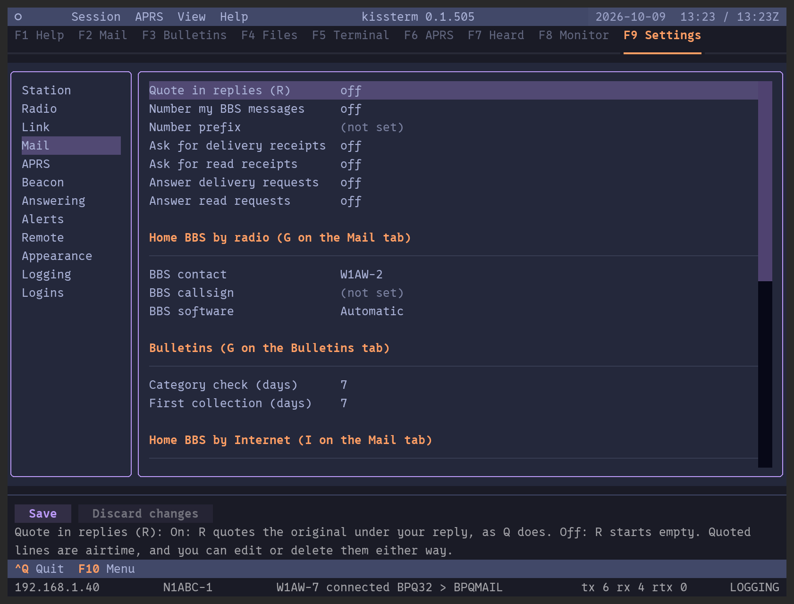

# kissterm

**A packet radio mail client and terminal.** kissterm opens to your
messages: mail from your local BBS and Winlink, bulletins, files, and the
forms emergency nets use. A terminal for talking to nodes, and APRS, are
one key away. It runs in any terminal window, including over SSH to a
Raspberry Pi in the shack.

- **Friendly to operators new to packet.** A node's commands are offered
  as you type, each with its meaning; the Help tab has guides and a
  glossary; and transmit starts off, so you can watch and learn first.
- **Free and open source** (MIT licence).
- **Cross-platform.** It is Python, with no kernel setup and no root. Linux
  and the Raspberry Pi are where it is used every day; macOS and Windows
  run the same code but have had less testing.
- **Talks to your TNC directly**: a USB or serial TNC, a Bluetooth TNC, or
  Direwolf or SoundModem on this computer or another one on your network.
- **More ways to use it are planned.** Today kissterm is a text interface.
  A desktop app (Windows, macOS, Linux) and a web version for a tablet or a
  shelter laptop are on the roadmap, built on the same core
  ([ROADMAP](docs/ROADMAP.md), P7a).



## A quick tour

**Mail (F2).** All your inboxes in one list: your local BBS and Winlink,
each message saying where it came from. Press **G** to send and receive
over the radio, or **I** to do the same over the Internet. Insert writes a
message; R replies. Every message is a plain text file you can open in any
editor.

**Forms.** ICS-213, ICS-213RR, ICS-205, ICS-214, ICS-309, damage
assessments, Winlink and PKTNET check-ins, ARRL radiograms and more. Fill
one in like a paper form; kissterm formats it the way other stations
expect. A form you receive is shown as a form:





**Bulletins (F3).** Notices to everyone, filed by category (WX, ARES,
ALL), kept apart from your personal mail.



**Files (F4).** Attachments from Winlink messages, with Downloads and
Received folders for file transfers (still being connected up). Nothing
that arrives over the air is ever opened or run for you.



**Terminal (F5).** Connect to a node or BBS and type at it. kissterm
recognises the software on the other end from what it sends anyway (it
never asks) and offers that system's commands with a one-line meaning as
you type. Nothing is sent until you press Enter.



**APRS (F6).** Messages with other stations, with delivery
acknowledgements, and a directory of APRS gateway services: SMS, email,
weather and more.



**Heard (F7) and Monitor (F8).** Who is on the channel, how far away and
in which direction; and every frame in both directions, decoded, for when
you want to see exactly what happened.





**Settings (F9).** Everything the setup wizard asks is editable here, one
section at a time, with a line of help for each setting.



## New to packet?

Packet radio sends text between stations as small bundles of data called
frames, usually at 1200 baud on 2 m FM. A few words you will meet:

- **TNC** (terminal node controller): the modem between your radio and your
  computer. It can be a box (a Mobilinkd, a NinoTNC, a Kantronics in KISS
  mode) or software, such as [Direwolf](https://github.com/wb2osz/direwolf)
  with a sound-card interface like a Digirig or SignaLink. kissterm talks
  to it using **KISS**, the common language TNCs speak.
- **Node**: a station others connect to, which passes you on to other nodes
  and to services such as a BBS. BPQ32/LinBPQ is the most common.
- **BBS**: a mailbox station. You connect, list and read your messages,
  and send new ones. kissterm does this for you when you press G.
- **Winlink**: radio email that reaches the Internet. kissterm speaks its
  protocol over packet or over the Internet.
- **APRS**: short position reports and messages, sent to everyone.

**What you need:** a radio with a TNC or a sound-card interface, your
callsign, and a computer with Python 3.11 or newer. You do not need to
transmit to start: kissterm launches with transmit **off** (the status bar
says `TX OFF`), so you can watch the channel, read the Monitor and learn
the local nodes first. `Ctrl+T` turns transmit on, and connecting to a
station you name turns it on for you, with a notice.

The Help tab (F1) has guides written for newcomers: getting on the air, a
first connection, reading a failed connect, APRS messaging, and sharing
the channel politely. Its glossary explains packet jargon.

## Install

kissterm is not on PyPI yet. Install it from GitHub with
[pipx](https://pipx.pypa.io/) or [uv](https://docs.astral.sh/uv/):

```bash
pipx install "git+https://github.com/bradbrownjr/kissterm"
# or
uv tool install "git+https://github.com/bradbrownjr/kissterm"

kissterm
```

The first run asks for your callsign, then looks for your TNC: USB serial
ports, paired Bluetooth TNCs, and Direwolf or SoundModem on your network.
Pick one and you are set. [SETUP.md](SETUP.md) walks through Direwolf,
Bluetooth pairing, serial permissions, VARA and the Raspberry Pi.

## Keys

kissterm follows the old DOS and Midnight Commander convention: **F1 is
help, F10 is the menu, and every command is in the menu.** The bar at the
bottom shows the keys that work on the tab you are looking at, and each
can be clicked. `Ctrl+P` finds any command by name.

<!-- keys:start (generated by scripts/sync_docs.py from kissterm/ui/commands.py; do not edit) -->
| Key | What it does |
|-----|--------------|
| `F1` | **Help** -- Keys for this tab, guides, glossary and About |
| `F2` `F3` `F4` `F5` `F6` `F7` `F8` `F9` | Show the Mail / Bulletins / Files / Terminal / APRS / Heard / Monitor / Settings tab. Each tab's label starts with its key |
| `F10` | **Menu** -- Every command, grouped |
| `Ctrl+T` | **Transmit on/off** -- The master transmit switch; nothing keys the radio while it is off |
| `Ctrl+N` | **Connect** -- Connect to a station, node or BBS |
| `Ctrl+D` | **Disconnect** -- End the session on the active Terminal tab, or cancel a connect that is still trying (Terminal) |
| `Ctrl+R` | Terminal: **Reconnect** -- Connect again to the station this Terminal tab was connected to, the same way (hops and login included); APRS: **Services** -- Pick a gateway service (SMS, email, weather) and fill in the message |
| `Ctrl+W` | Terminal: **Close tab** -- Close the Terminal tab on screen; a connected one is disconnected first. Delete does the same while the tab row has focus; APRS: **Close conversation** -- Close the conversation tab on screen. Delete does the same while the tab row has focus |
| `Ctrl+G` | Terminal, Mail, Bulletins, Files: **Address book** -- Show or hide the Address Book; APRS: **Contacts** -- Show or hide the contacts list |
| `Ctrl+F` | **Find** -- Search the terminal scrollback (Terminal) |
| `Ctrl+L` | **Clear** -- Clear what this tab is showing (Terminal, APRS, Monitor) |
| `Ctrl+Q` | **Quit** -- Leave kissterm |
| `Ctrl+P` | **Search commands** -- Find any command by typing part of its name |
<!-- keys:end -->

## Safe by default

- **Nothing transmits until you say so.** Transmit starts off; the switch
  (`Ctrl+T`) is enforced where every frame leaves the program, so no
  timer, beacon or bug can get around it.
- **Nothing transmits on its own unless you turn it on.** Answering calls
  and beaconing are off on a fresh install, and the status bar shows
  `ANSWERING` or `BEACON` while they are on.
- **Airtime is shared.** kissterm never asks a node something just to fill
  in its screens; command lists ship with it.
- **Text from other stations is filtered** before it reaches your screen,
  so a garbled or hostile frame cannot take over your terminal.
- **Passwords are kept in your system keyring** (GNOME Keyring, KWallet,
  macOS Keychain, Windows Credential Locker) where there is one, and your
  Winlink password never goes on the air.

## Status

kissterm is young (version 0.1) and changing quickly. The AX.25 link,
KISS transports, terminal, monitor, heard list, APRS and BBS mail have been
used on the air. Winlink, VARA, Mercury and file transfers (YAPP, AutoBIN)
are built but not yet proven on the air, and collecting bulletins from a
BBS by category is next. Winlink's production servers do not recognise
kissterm yet; until they do, the Internet server setting in
Settings > Mail can use Winlink's test server.

- [docs/GUIDE.md](docs/GUIDE.md): the user guide, everything in detail.
- [SETUP.md](SETUP.md): getting on the air with your hardware.
- [docs/ROADMAP.md](docs/ROADMAP.md): what is planned.
- [docs/CHANGELOG.md](docs/CHANGELOG.md): what has changed.

Found a bug? `kissterm --doctor` output makes a report much more useful.

## How it works, briefly

Most Linux packet programs rely on the kernel's AX.25 stack, which needs
root to set up and cannot reach a TNC over the network. kissterm
implements AX.25 connected mode itself, in ordinary user code, over KISS.
That is why it installs like any other program and runs the same way on
every platform.

## Development

[AGENTS.md](AGENTS.md) is the engineering document and
[DESIGN.md](DESIGN.md) the interface standard; read both before changing
anything. [docs/PROTOCOL_GUIDE.md](docs/PROTOCOL_GUIDE.md) cites the
specifications behind every wire format.

```bash
git clone https://github.com/bradbrownjr/kissterm
cd kissterm
python3 -m venv .venv && .venv/bin/pip install -e ".[dev]"
git config core.hooksPath hooks     # once per clone: version bump + dep resync
.venv/bin/kissterm
```

The AX.25 stack is tested against a software loopback with frame loss, so
the link layer is exercised without a radio. The screenshots come from
`scripts/generate_screenshot.py`, with invented stations.

## License

MIT. See [LICENSE](LICENSE).

The Winlink secure login and LZHUF code (`kissterm/winlink/`) are ports of
[wl2k-go](https://github.com/la5nta/wl2k-go), Copyright 2015-2016 Martin
Hebnes Pedersen (LA5NTA), MIT licence, and its test data ships in
`tests/unit/data/winlink/`. The RMS gateway list request and mode filter
follow [Pat](https://github.com/la5nta/pat) (same author, MIT licence).
LZHUF itself comes from JNOS 2's `lzhuf.c` (Okumura, Yoshizaki, Rikitake),
whose authors' terms are "Use, distribute, and modify this program freely".

Portions of this project were developed with AI assistance (Claude).

## Author

Brad Brown Jr, KC1JMH — [github.com/bradbrownjr](https://github.com/bradbrownjr)
