# kissterm user guide

Everything kissterm does, in more detail than the [README](../README.md).
For getting your hardware on the air, see [SETUP.md](../SETUP.md).

1. [Getting around](#getting-around)
2. [Mail](#mail)
3. [Bulletins and Files](#bulletins-and-files)
4. [Connecting to nodes and BBSes](#connecting-to-nodes-and-bbses)
5. [The Address Book](#the-address-book)
6. [APRS, Heard, Monitor and beacons](#aprs-heard-monitor-and-beacons)
7. [Settings](#settings)
8. [When a connection does not come up](#when-a-connection-does-not-come-up)
9. [Safety](#safety)
10. [Command line](#command-line)
11. [Why kissterm exists](#why-kissterm-exists)

## Getting around

kissterm follows the keyboard convention of Midnight Commander and DOS-era
text programs: **F1 is help, F10 is the menu, and every command is in the
menu.** Shortcuts are for the commands you use most, not the only way in,
so there are few of them, and they are keys an ordinary terminal can
deliver. The full table is in the [README](../README.md#keys).

- **The bottom bar shows the keys that work on this tab, right now**, as
  many as fit, with `F10 Menu` always at the right. Every key in it can be
  clicked, and `Ctrl+P` finds any command by typing part of its name.
- **The F10 menu** holds everything else: send a beacon, send a position
  report, objects, bulletins, gateway forms, Watch APRS-IS, file transfer,
  the NET/ROM panel, your callsign and saved transcripts. Press the
  underlined letter; Left and Right move between headings. A command that
  cannot run right now is listed anyway, dimmed, with the reason.
- **Inside a list** (the Address Book, APRS contacts) `Enter` is the
  default action, `Insert` adds, `E` edits and `Delete` forgets.
- **Copying text:** drag over it with the mouse in the terminal, Monitor,
  APRS or mail reader; it is copied when you let go (`Ctrl+C` copies it
  again). The copy reaches your clipboard through the terminal (OSC 52); a
  multiplexer such as tmux has to be set to pass that through.
- **Closing a tab:** each Terminal connection and each APRS correspondent
  gets a tab. Close the one on screen with `Ctrl+W`, the small **X** at the
  end of the tab row, the menu, or Delete while the tab row has focus. A
  connected Terminal tab is disconnected first.
- **In the send line and the APRS compose box**, Ctrl+Backspace and
  Ctrl+Delete delete a word. Some terminals send Ctrl+Backspace as plain
  Backspace; `python scripts/keycheck.py` shows what yours delivers.
- **`Ctrl+D` is Disconnect, and still deletes a character.** Text fields
  use it to delete the character to the right; kissterm claims it only
  while there is a session to end. `Delete` always deletes.

**If `F1` or `F10` does nothing**, your terminal program took it first.
GNOME Terminal opens its own help on `F1` and its menu bar on `F10` until
you turn off "Enable the menu accelerator key" in its preferences. Clicking
the Help tab, or Menu in the bottom bar, works regardless.

**Running under tmux or screen?** Nothing needs configuring. kissterm binds
no key a multiplexer takes (no `Ctrl+B`) and nothing that needs an
enhanced keyboard protocol (no `Ctrl+Shift+` anything, no `Ctrl+Alt+`
anything, no Alt keys).

**The Help tab (F1)** is written for someone new to packet. Its *Guides*
walk through getting on the air, a first connection, the transmit switch,
reading a failed connect, APRS messaging and sharing the channel. *Node
commands* lists what each common node type understands, without connecting
to one. *About* shows the version and where your config and logs are, for
a bug report.

## Mail

kissterm opens on the Mail tab (Settings > Appearance > Open on can make
it Terminal instead): a folder tree, the message list, and a reader.

- **Folders are by kind of mail, not by how you reached it.** All Inboxes,
  then BBS and Winlink, each with Inbox, Outbox, Sent and Deleted. Each
  message says where it came from.
- **Every message is a plain text file** under kissterm's data folder, so
  any editor can read one. Delete moves a message to Deleted; U puts it
  back.
- **Routing.** A message read from a BBS says which BBSes it passed
  through, in order, on one line under its header ("Routing ▸"); **T** shows the `R:` line each BBS added as it passed the
  message on, the latest first, and T again folds them away. A
  number@BBS there is that BBS's message number, not the sender's
  address.

### Send/Receive by radio (G)

**G** sends your Outbox and gets your mail from the BBS set in
Settings > Mail (BPQMail so far). It dials the Address Book entry named
there, lists your mail with `LM`, reads only what kissterm does not
already have, and signs off with `B` (the BBS says goodbye and hangs
up; if it has not within 30 seconds, kissterm disconnects), all shown
in the Terminal tab as it happens (the BBS's side and the commands kissterm sent; progress is in
the status bar, and a note of each step in the session's transcript). Messages stay on the BBS. Anything missing (the entry to dial, a
password, a BBS login) is asked for before anything is dialed, so a
missing setting never costs airtime.
While a run is going, **G cancels it** (the Footer says "Cancel run"):
a radio run's SABMs stop, or its link is disconnected; an Internet run
is stopped.

On a Winlink folder, G sends and receives with a Winlink RMS gateway
instead: Settings > Mail > Winlink names the Address Book contact that
reaches it, and your account password, which never goes on the air (only
the answer to the gateway's challenge does). F10 > Session > RMS gateways
lists gateways nearest you by mode; the one you choose becomes an Address
Book contact. That list comes from winlink.org when you ask, and needs an
access key kissterm is still waiting for. Winlink over packet is not yet
proven against a live gateway.

On All Inboxes, G does both: the Home BBS first, then Winlink.

### Send/Receive by Internet (I)

**I** does the same without the radio: the Home BBS through a Telnet or
SSH contact in the Address Book (the node's `user:` and `password:` are
answered with a saved login, then `BBS` is sent), and Winlink through the
CMS by Telnet. If the contact has a Node login, that is what answers
the node. Otherwise, the first time, I asks for the contact, the username
and the password in one question and saves them as a login. Internet contacts
never touch the transmit switch.

Winlink's production servers refuse programs they do not recognise, and
kissterm is not recognised yet. Until it is, the Internet server setting
in Settings > Mail can use Winlink's test server.
That setting is only for kissterm's own Internet connection. Over the
radio, the gateway (WS1EC-10, say) makes its own connection to the
production servers, and kissterm cannot redirect it: the refusal comes
back through the gateway ("Unknown client types are not allowed on
production servers") until the gateway's operator or Winlink changes
something.

### Writing messages

**Insert writes a message, R replies and Q replies with the original
quoted** (Settings > Mail can make R quote too). A message waits in the
Outbox, and G sends it before reading, moving it to Sent once the BBS
accepts it. Insert on a Winlink folder writes a Winlink message (several
callsigns or email addresses, no @), and R on one received from Winlink
answers by Winlink. **A replies to all**: on a Winlink message sent to
others besides you, the sender and every other recipient (the Footer
shows A only then).

**Numbered messages** (Settings > Mail > Number my BBS messages, off by
default): a BBS message you write is titled `ABC-12P: your title` (a
prefix, the station's next number, P for private or B for a bulletin) as
Outpost does, so you can follow it across BBS forwarding. The prefix is
the last three of your callsign unless you set one. The number counts on
and is never reused. Winlink messages, forms, radiograms and replies sent
by number are not numbered, and BPQMail's 60-character title gives way
before the number does.

**Receipts** (Settings > Mail, all off by default) work the way Outpost's
do. **Ask for delivery receipts** and **Ask for read receipts** put
Outpost's request flags at the start of every private BBS message you
write (a plain BBS or another client shows the flag at the start of the
text; kissterm and Outpost hide it). **Answer
delivery requests** queues a `DELIVERED: <title>` message to the sender
for each downloaded message that asked; **Answer read requests** queues a
`READ: <title>` the first time you open one that asked. A receipt waits in
the Outbox, so you can read or delete it, and goes with your next
Send/Receive: nothing is sent by itself. A receipt is never answered with
another. Opening a message on the phone now marks it read, as the
terminal does.

**Type: NTS radiogram** opens an ARRL radiogram form. Each word converts to
its radiogram form as you finish it (a period becomes X, `ARL 46` becomes
ARL FORTY SIX, with its meaning shown), the Check field counts the groups,
the `ST <zip> @ NTS<state>` routing shows as you type, and it suggests
your next message number. **Radiogram-ICS213** is the same form with HXI
and a subject line, as the 2026 RRI guidelines give it.

### Forms

The ICS-213 General Message, ICS-213RR Resource Request, Winlink Check-in,
Field Situation Report, Severe WX Report, Damage Assessment, Incident
Status Report, ICS-309 Communications Log, ICS-214 Activity Log and
ICS-205 Radio Plan are message Types, in Winlink's layouts. The PKTNET
net's forms (vden.org/pktnet) are Types too, in their own layouts: the
PKTNET Check-in, Bulletin, ICS-213, Field Situation Report, Severe
Weather Report and Form 309 Log. Each is laid out as
its published form, so any station can read it; you fill in the form,
then address it like any message. The 309 can fill its log from your mail,
and the PKTNET check-in comes back addressed `SB PKTNET@USA`. Sent by
Winlink with its text unedited, a form carries the XML attachment Winlink
Express reads.

A form you receive is shown as the form, each value under its label; V
shows the text as sent. R on an ICS-213 offers Reply on form, with blocks
1-8 read-only and 9-10 yours to fill.

**Information strips** (`TITLE/question/.../question//`): GYX Weather
Report and MCF720 ship, "Information strip (paste)" answers any other, and
a reply to a message carrying a strip offers Answer strip.

## Bulletins and Files

**Bulletins (F3)** are notices addressed to a category (WX, ARES, ALL)
rather than a person, filed by category and kept apart from your mail.
Write one on the Mail tab with Insert, Type: Bulletin; G there sends it.

**Getting bulletins (G on the Bulletins tab; I over the Internet).** A
BBS can hold hundreds of bulletins in one category (WS1EC-2 had 310 in
WX), so kissterm collects only the categories you choose:

- The first G connects to your Home BBS, asks for its category list and
  shows it with each category's count. Tick the ones you want, or All
  (every category, including new ones as they appear).

  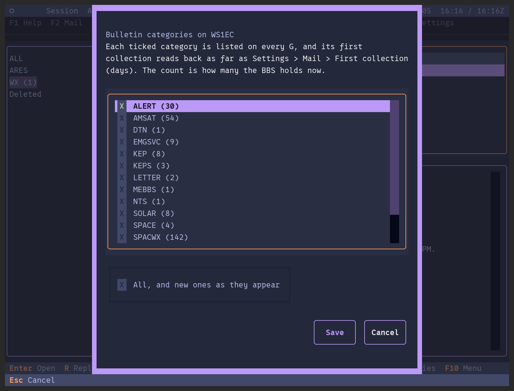

- The list itself is airtime, so it is asked for again only every
  Settings > Mail > Category check (days), 7 by default. A category that
  has appeared since is offered then; one you leave unticked is not
  offered again.
- The first collection from a category goes back Settings > Mail > First
  collection (days), 7 by default, listing a hundred message numbers at a
  time so it can stop as soon as the bulletins are older. A category the
  list counted 20 or fewer bulletins in is listed whole in one command
  instead. Later collections ask only for bulletins newer than the newest
  you have.
- Each bulletin is read with its own command, so a long backlog is a
  long run, especially over the air. When more than 20 are new, kissterm
  asks first: **Newest 20** (the default; Enter), **All**, or **None**
  (Escape; nothing is read, and the next run lists them again). Reading
  the newest leaves the older ones behind for good: the next run starts
  after the newest read. The phone asks the same question as a sheet.
- **S** changes your choice at any time, offline, from the categories the
  BBS listed last.
- Bulletins are filed under Bulletins, one folder per category. Nothing
  is ever deleted from the BBS.

**Files (F4)** has three folders:

- **Attachments**: files that came with Winlink messages, saved under
  cleaned names.
- **Downloads**: files you download with a file transfer (below). A
  name already there is saved as `name-1.ext`, never over the first.
- **Received**: kept for files that arrive while you are away, which needs
  the unattended mailbox (ROADMAP P9); empty until then.
- **Deleted**: Delete on a file moves it here; U puts it back where it
  was, under its own name.

**S sends the highlighted file** to the station you are connected to,
by YAPP or AutoBIN: it opens the file-transfer dialog with the file
filled in, and nothing goes out until you press Start. S shows only while
a session is connected in the Terminal.

**Enter opens a file in the viewer**, full screen; clicking one still
shows a plain preview in the reader, and Esc closes the viewer.

- **A zip** lists its files and sizes; Enter on one opens it, and Esc goes
  back to the list. Nothing is unpacked to disk: each file is read from
  the zip in memory, up to 1 MB, and a password-protected one is refused.
- **Markdown** is shown formatted.
- **HTML** is shown formatted too: headings, lists, tables and
  preformatted text are kept, and a form's boxes are drawn as blanks
  (`[________]`, `[Routine v]`). Scripts are not run and nothing the page
  links to is fetched; links show their address and are never followed.
- **Other text** is shown as text; anything else is named with its size.

**Enter fills in a PKTNET form.** The PKTNET packet forms (vden.org/pktnet,
the zips WS1EC-2 offers) are recognised by their title, and Enter
opens opens kissterm's own form for that page: the Bulletin, Check-in, ICS-213,
Field Situation Report, Severe Weather Report or Form 309 Log, each
written in the page's layout, or the NTS radiogram (kissterm's radiogram
screen, laid out by the ARRL rules rather than the page's). You fill it in and address it as any message; it waits
in the Outbox. The page's script is never run; kissterm's form writes the
same text its Generate button does, checked against the page itself.

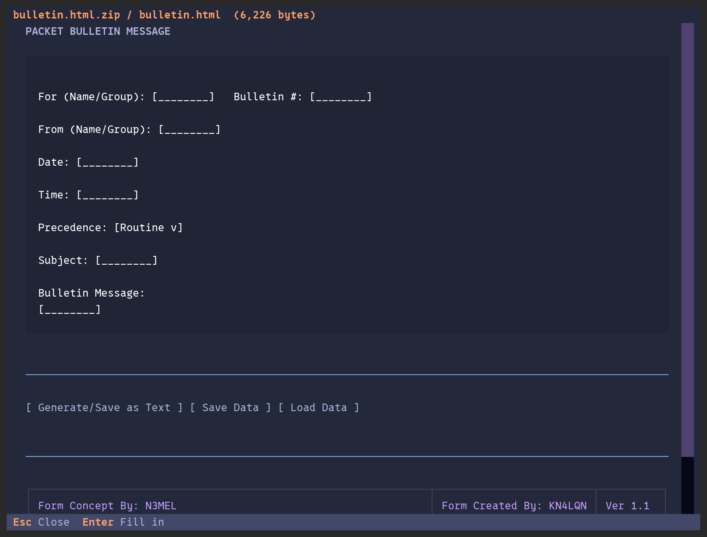

Nothing that arrives over the air is ever opened or run for you.

**Getting files from the Home BBS (G on the Files tab)**: G connects
to the Home BBS over the air (the route and login Send/Receive uses),
asks it for its `FILES` list and shows a checklist: each file's size and
about how long it takes on the air at 1200 baud, with the total of what
you tick. Nothing is ticked at first, and a file already in Downloads at
the same size says so. Download fetches each ticked file by YAPP into
Files > Downloads, one after the other, the status bar counting bytes;
then kissterm disconnects. A name the BBS no longer has is noted in the
session log and the rest still come. Radio only: there is no I for files
(see "Not over SSH" below). Built against WS1EC-2's listing and BPQ's
source; not yet tried over the air (experimental).

**File transfers (YAPP and AutoBIN)**: to download from a BPQ BBS by hand, type
`FILES` to see what it has and `YAPP <name>` to ask for one. The
download starts by itself when the BBS begins sending, within a minute of
asking; the status bar counts the bytes, the Terminal stays quiet while
it runs, and the file is saved in Files > Downloads with a toast naming
it. Nothing arrives unasked: a sender you did not ask in the last minute
is ignored. To upload, F10 > Session > File transfer (or S on a file in
the Files tab), pick the file (Browse files, then Choose or Enter) and
press Start; BPQ takes a YAPP upload
at its prompt. If a transfer fails on kissterm's side (a timeout, a file
it will not save), it tells the BBS with a YAPP cancel, so the BBS
answers "File Rejected" and takes your next command as a command again. The dialog's Download is for AutoBIN, or a sender that
needs the receiver started first. A YAPP download and upload with WS1EC-2
have worked over the air (2026-10-03 and 10-04); AutoBIN is not yet
proven.

**Not over SSH.** An SSH login like WS1EC's runs `telnet` into the node on
the server, and that holds YAPP's replies until a line end, so a transfer
cannot finish. kissterm does not send `YAPP <name>` over SSH: the line
stays in the send field with a notice, and File transfer and S on the
Files tab are refused there too. Connect by radio for files.

## Connecting to nodes and BBSes

The Terminal (F5) is for what needs you at a prompt: the applications a
node offers (chat, weather, callsign lookups, a BBS by hand) and anything
else you connect to. `Ctrl+N` connects to a station, node or BBS. A
digipeater path works too:
`WS1EC-7 via W1AW-1,W1XYZ`.

**The connect dialog remembers where you have been.** `WS1EC-15` and
`WS1EC-7` are different services on one machine, and a mistyped SSID fails
in a way that looks exactly like a bad RF path, so every target you
confirm is kept. Typing narrows the list, Down moves into it, Enter
connects, and Delete forgets a row. Each row shows whether it has ever
actually connected.

**If you have more than one transport of the same kind configured**, the
Connect dialog can switch between them before dialing. Switching between
a KISS TNC and a VARA host needs a restart (Settings > Radio).

### Help at the prompt

The hard part of a node's command line is that nothing on screen tells
you what you can type. kissterm identifies the node you connected to
(BPQ32, JNOS, a TNC2 command mode) from the banner and prompt it sends
anyway, never by asking it anything, and knows that software's commands:

- **As you type**, matching commands are listed with what each does. Up
  and Down choose one; Tab fills it without sending; Esc hides the list.
  Typing `BYE` finds `B`. A command that takes a number or callsign fills
  only the command; you supply the rest.
- **The list follows the session.** At a BPQ32 node `L` offers `LINKS`;
  once the node says `Connected to BBS`, it offers BPQMail's `L`, `LM`,
  `LR` and the rest; `Returned to Node` switches back. At a prompt it
  cannot identify, it suggests nothing rather than guess.
- **F10 > Help > Node commands** lists every command in reach, each
  marked with where it came from: **published** (the software's own
  documentation), **verified on air**, **recalled, unverified**, or
  **harvested only** (a name a node offered that no documentation
  describes). [SOURCES.md](SOURCES.md) lists every document, source file
  and captured session behind these.
- **BBS mail helpers** (Node commands > BBS mail helpers) give starting
  commands for listing mail, reading a message and writing one. Choosing
  one only fills the send line. On the web and phone client, Commands >
  BBS mail does the same into the message box.
- **Learn from node** asks a node for its own command list once, tells you
  what that costs in airtime first, and caches the answer for good.

Detection is deliberately conservative: a wrong command set shown with
confidence is worse than an honest "unknown node".

### The terminal only sends when you say so

The conversation is read-only: scroll it, select and copy from it, click a
URL in it. The send line at the bottom is the only thing that transmits,
and only when you press Enter or click Send. Suggestions fill the line;
they never send it.

**Remote colour, not remote control.** Text from a BBS passes an allowlist:
colour, bold and underline survive (turn them off with
`remote_color = false`); cursor movement, screen erase, window titles,
clipboard writes and every other escape sequence are removed, whatever the
setting.

**The Terminal shows only the session:** what the far end sent and what
was sent to it. kissterm's own notes (connecting, connected, a login
script starting, a hop that failed) go to the status bar, a notice, and
the session's transcript.

**Session transcripts:** one plain-text file per connection, everything
sent and received plus kissterm's notes, timestamped, with colour codes
removed. Read them from Session > Transcripts, or the Transcripts button
on the Monitor tab. A connect that never came up has no transcript; its
notes are in kissterm.log.

**If you send a line and nothing comes back**, kissterm says so: fifteen
seconds after a send the far end acknowledged at the link layer with no
reply since, a notice says `<call> acknowledged that -- no reply yet`. The
link is fine; the far application is slow or silent.

### Telnet and SSH

A node reachable over the Internet is an Address Book contact, By Telnet
or SSH, dialed into its own Terminal tab beside the radio. It never
touches the transmit switch. SSH signs in with a saved login (username and
password) or a key. The first connect shows the server's key fingerprint
and asks you to Trust it; after that a different key is refused
([SETUP.md](../SETUP.md) section 6a). An SSH contact has two sign-ins, kept
apart: **SSH** is the server's own account (a login may be a username with
no password, for an account that has none), and **Node login** is what is
sent to the node once SSH is up (a saved login or a saved script).

A BPQ node's Telnet port echoes back what you type; kissterm drops that
echo, so each line shows once. The password line of a saved login is
shown as `********`, on screen and in the transcript. The status bar
names the contact by its host (`WS1EC`, not the full address).

Telnet and SSH need no modem. If kissterm starts while the modem software
or TNC is off, it waits on it with a countdown; press **Enter** to skip
the wait and start without it. Your Internet contacts work as usual, the
status bar shows `NO TRANSPORT`, and once the modem is running, Save on
Settings > Radio opens it. (On Windows the wait cannot be skipped yet; it
gives up at the countdown and asks whether to start anyway.)

### Link behaviour

Full AX.25 2.2 connected mode, with retransmission and timer recovery, so
a marginal path recovers instead of dropping you. Modulo 128 is supported;
modulo 8 is the default, because it is what everything on the air speaks.
Connect retries and the link's retry limit (N2) are separate settings, both
10 by default: retrying a connect is one keystroke, and dropping a live
session over a fade is the expensive mistake.

Frame size adapts to the path. Frame size (paclen, Settings) is the
largest the link will send, and it starts there. If the far end answers
our polls but twice in a row still has not received a data frame, the
link halves the frame size (down to 32 bytes), cuts the waiting data
into smaller frames and sends it again; after a few clean frames it
doubles back up toward your setting. kissterm.log says
when it changes. A per-entry paclen in the Address Book still caps it.

## The Address Book

`Ctrl+G` on the Terminal, Mail, Bulletins or Files tab opens the Address
Book as a panel: every saved station, with the Connect button to dial one
(Enter or a double click; a single click only selects). Insert adds, E
edits, Delete forgets, as in SyncTERM's dialing directory. It lives in
`addressbook.json` in your data folder, not in `config.toml`. An entry can
carry:

- **A node-to-node hop chain**, for a station reached only through other
  BPQ/NET-ROM nodes: kissterm connects to the first and sends `C <node>`
  for each hop, waiting for each CONNECTED before the next.
- **A saved login** (a username and a password) or **a saved script** (any
  lines to send after connecting, such as a login followed by a hop). There
  is no box to type lines into; make a script with "New script...".
  Both are managed in Settings > Logins and looked up fresh at every
  connect, so changing one updates every station that uses it. Passwords
  are kept in your system keyring (GNOME Keyring, KWallet, macOS Keychain,
  Windows Credential Locker) when there is one; `config.toml` holds only
  the login's name and username.
- **A frequency and connection type**, as a reminder: kissterm cannot tune
  a radio, but it asks you to confirm both are set before a connect that
  has them on file.

## APRS, Heard, Monitor and beacons

**APRS (F6):** positions (uncompressed, compressed and Mic-E), messages,
status, objects, weather and telemetry. Messages have a tab per
correspondent, with acknowledgements shown; `Ctrl+G` opens your contacts
and the directory of APRS gateway services, and `Ctrl+R` fills in a
message to one (SMS, email, weather).

**The map (F10 > APRS > Map).** Every station heard with a position
(an APRS report, or a grid square in a node's text), every object and
item received with coordinates, and your own station, on a map drawn in
braille dots. The map ships with kissterm and needs no Internet:
coastlines, country and state lines everywhere, and once zoomed in
closer than about 6 degrees across, county lines, major and secondary
highways, rivers, lakes and a more detailed coast (from Natural Earth).
Below it is the list, nearest first, with the distance and bearing each
station reports, when it was last heard, its comment, and who reported
an object. Positions are what stations claim, which is why the list
says "reported". The list has the keys: `I` zooms in, `O` zooms out,
`F` shows everything, and `Enter` centres the highlighted point, which
is marked on the map as the cursor moves. `Tab` moves to the map, where
the arrows pan and `PgUp` and `PgDn` zoom; the mouse wheel zooms and a
click centres. A killed object leaves the map at once. Objects are kept
only while kissterm runs; stations come from the Heard list.

**Placing an object from the map.** The `x` at the map's centre (its
position is in the heading) is where `Insert` puts a new object: pan or
click until the `x` is on the place, then `Insert` opens the object form
(APRS > Object) filled in with it. The objects you send show on your map
at once, marked "yours" in the list. On one of yours, `M` moves it to
the `x` and `Delete` kills it; each opens the same form, its name,
symbol and comment kept. Only the form's Send object button transmits,
turning transmit on as APRS > Object does, and nothing repeats an object:
other stations keep it only as long as their software does. Terminals
without braille in their font (Settings, ASCII-safe mode) get dots instead.
Nothing on the map transmits.

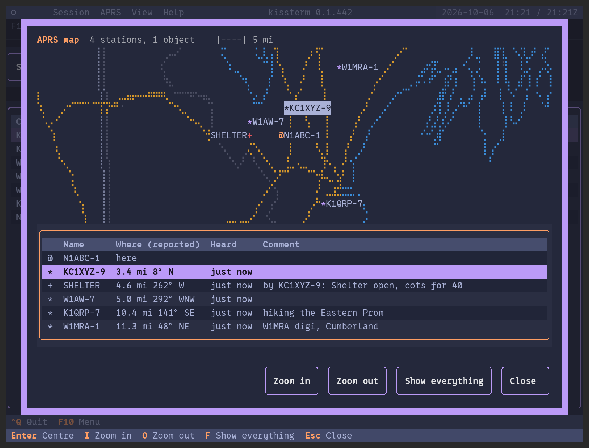

**Heard (F7):** who you have heard, when, how often, by what path, and
whether directly or through a digipeater. Once kissterm knows where you
are, it shows the bearing and distance to any station reporting a
position, whether from an APRS beacon or a grid square in an ordinary
node's text ("de W1AW FN31pr").

**Monitor (F8):** every frame on the channel in both directions, `>` for
what you sent and `<` for what was heard, decoded the way `listen` and BPQ
show it, with a filter by callsign or text. Supervisory frames (RR, RNR,
REJ) are shown by default, because on a one-to-one link an RR coming back
is the "did they get it" answer; the filter bar's Supervisory button hides
them on a busy channel.

**Mail waiting, without connecting to check.** Nodes using the W0RLI/FBB
"MAIL FOR" convention beacon the callsigns they hold mail for; kissterm
watches for yours and tells you the moment it hears it.

**Beacons.** A short text on a timer telling the channel you are there
(the `BTEXT` convention, separate from APRS beaconing). Off until you turn
it on, never sent empty, with a ten-minute floor. Settings shows what your
interval costs the channel. The timer waits a full interval before its
first transmission; F10 > Session > Send beacon sends one now.

## Operating as a tactical call

A tactical call names an assignment instead of one operator, so the net
keeps the same address as people change shifts: **CCEMA** for the EOC.
In Settings > Station, set **Tactical call** (at most 6 letters or digits
and an SSID, since it goes in the AX.25 address; `CCEMA` or `CCEMA-1`, not
`WSSM-ECT`) and turn on **Operate as the tactical call**. Connections then
go out as CCEMA and the station answers on it, and the status bar shows
`CCEMA` and `ID KC1JMH`. It takes effect when no session is up.

APRS, Winlink and VARA keep your own callsign, and a BBS knows a user by
the call it hears, so the BBS needs an account for the tactical call. Your
own callsign still has to be identified: with **Identify with my
callsign** on (the default), kissterm sends `DE KC1JMH-7 (CCEMA)` to `ID`
when a link made under the tactical call ends, whether it was used or
never came up, and every 10 minutes while one stays up. It is sent only
while operating as the tactical call and only with transmit on; if
transmit is off it says in words that you must identify yourself. It is
your station's identification, and you remain responsible for the
schedule the rules require.

## Settings

**Nothing you answer at setup is locked in.** Settings (F9) lists its
sections down the left. Up and Down choose a setting, Enter changes it on
its row (an on/off setting just flips), Enter again keeps it and Esc puts
the old value back. The help for the highlighted setting is in a line at
the bottom, and settings a new operator never needs (T1/T2/T3, retries,
SmartBeaconing's curve) are under each section's Advanced. A change says
"(unsaved)" until you press Save or Discard changes.

**Finding hardware.** The first run, and "Scan for hardware" in
Settings > Radio, look at serial ports (recognising common TNC chipsets by
USB ID), paired Bluetooth TNCs, and your network's well-known KISS, AGWPE
and VARA ports. A network scan covers the whole subnet, and says so if it
ran short. The network is only scanned when you ask; USB TNCs are noticed
when you plug them in, and one you are using that gets unplugged is
reported at once. Serial and Bluetooth TNCs are labelled experimental:
they are built, but not yet proven with real hardware (ROADMAP P3).

**"New" adds a transport a scan cannot find**, such as a VARA modem.
**"Test" asks a configured host what it actually is**: an AGWPE engine
answers its version query, a KISS TNC is confirmed when a frame arrives,
and a web server or SSH banner is reported as what it is. A port that is
open and silent stays "unconfirmed", since that is exactly what a working
KISS TNC looks like on a quiet channel.

**Changing your callsign** is Session > My callsign in the menu, or
`kissterm --callsign W1AW-9`; neither re-runs the setup wizard. It is
refused while a link is up.

**Clock.** Local time, UTC and the date are independent toggles
(Settings > Appearance). UTC is always marked (`Z`, or `UTC` on a 12-hour
clock); dates are ISO 8601 (`2026-09-05`), never locale order.

**Themes.** Every colour is a theme variable, so switching repaints the
whole app at once. Textual's themes across Tokyo Night (the default),
Catppuccin, Nord, Gruvbox, Dracula, Monokai, Solarized, Rose Pine, Atom
One and Textual's own; `ansi-dark` and `ansi-light` use your terminal's
own 16-colour palette, and so does `midnight-commander`, Midnight
Commander's standard skin (lightgray on blue, a black-on-cyan cursor bar),
taken from mc's own `misc/skins/default.ini`. The other themes need a
terminal that reports truecolor (`COLORTERM=truecolor`, which SSH does not
pass on by default); without it their colours are rounded to the nearest of
256 and look wrong (Tokyo Night's panels turn navy). `kissterm --doctor`
says which you have. For an exact match to something else,
`theme = "custom"` reads a `[custom_theme]` table from `config.toml` (see
`config.toml.example`). An unknown theme name falls back to Tokyo Night.

## When a connection does not come up

Packet links fail for two different reasons that need opposite responses,
so kissterm never reports them with the same words:

- **`connection refused (DM)`**: the far end heard you and said no. Your
  signal is getting there. Check the callsign and SSID, and whether that
  node accepts connections from you.
- **`no answer from <call> after N tries`**: nothing came back at all.
  That is an antenna, power, squelch or propagation problem, not a
  configuration one.

**The Monitor (F8) is the real instrument**: watch your SABM leave and see
whether anything answers.

For a record you can read later or send to someone:

```
kissterm --log-level debug
```

writes every frame, every T1 expiry with its retry count, and every link
state change to `~/.local/state/kissterm/logs/kissterm.log` (macOS:
`~/Library/Application Support/kissterm/logs/`):

```
TX port 0: KC1JMH>WS1EC-15 SABM P cmd
T1 expiry 1 in connecting, rc=0 of 10
TX port 0: KC1JMH>WS1EC-15 SABM P cmd
state -> <AX25Link KC1JMH>WS1EC-15 failed V(S)=0 V(R)=0 V(A)=0>
```

A frame the transmit switch stopped is logged as `TX BLOCKED`, never as
sent.

kissterm.log is set aside as `kissterm.log.1` when kissterm starts and
finds it over 5 MB; the three most recent are kept (`.1` to `.3`), the
oldest dropped. Session transcripts in the same folder are never touched.

## Safety

**kissterm starts unable to transmit.** `Ctrl+T` is the master switch, off
at launch, the same convention WSJT-X uses. It is enforced at the one
place every frame and every byte passes through, so it holds for the link
layer, background timers and any transport added later. A blocked
transmission is counted and logged, never reported as sent.

**Asking to connect turns it on.** Naming a station and confirming the
connect (`Ctrl+N`, an Address Book dial, `Ctrl+R`) or disconnecting
(`Ctrl+D`) is a clear request to transmit, so it switches transmit on
rather than refusing, and says so: a notice, the status bar, and a line
in the session's transcript. Nothing without a confirmation step and a named station
does this.

**The two things that can transmit without you**, answering a call and
beaconing, are off on a fresh install, show `ANSWERING` and `BEACON` in the
status bar while on, and every transmission shows in the Monitor tab
and is logged to kissterm.log. With
answering off, a station calling you gets a polite refusal (a DM) so it
stops retrying. The same refusal goes to a node that polls a connection
you no longer have (kissterm was closed mid-connection); a notice says
so once per station, and Ctrl+D has nothing to end because there is no
link. Automatic-control rules differ by country and band; check
what your licence allows before turning answering on.

**Nothing in discovery or the connection test can key your rig.** A probe
writes two bare KISS `FEND` bytes (no command a TNC can act on) or an
AGWPE version query. VARA's ports are never touched, because its command
channel could start a session.

**Text from other stations is untrusted.** A corrupt frame off a noisy
channel produces the same bytes as a malicious one, and neither should be
able to repaint your screen in the middle of a net. Transcripts get the
fully stripped text.

**Passwords.** Kept in the system keyring where there is one. Your Winlink
password never goes on the air or into a log: only the answer to the
gateway's challenge is sent.

## Remote control (experimental)

kissterm can be driven from another machine: the station keeps the radio
and the TNC, and a phone, laptop or browser is a remote control for it.
Open the pairing link in a phone's browser and the station serves the
remote control itself; there is nothing to install on the phone. The
protocol underneath is in `docs/PROTOCOL.md`, for anyone writing their
own client.

- **Turn it on** in Settings > Remote > Remote control, and the station's
  own screen and every remote client share one station; `REMOTE` (with
  the number of clients connected) shows in the status bar while it
  runs. Or start `kissterm --serve`, which runs with no screen and prints
  its version and callsign ("kissterm 0.1.456 serving N1ABC-1"; again
  after each Restart), then the link and QR code; **Esc** or **Ctrl+Q** there stops it
  (Ctrl+C too). Both need the `serve` extra (SETUP.md
  section 11).
- **The pairing screen** shows the link and its QR code to scan with the
  phone, with Copy link, Rotate and a Settings button. It opens by itself
  when you turn remote control on and Save, until a device has paired
  with the link (and again after Rotate). Any time, even while remote
  control is off: the **Pairing link** button in Settings > Remote, or
  **Session > Remote pairing** (F10, then P).
  Starting the server takes a few seconds the first time (it loads the
  web app); the screen keeps working meanwhile.
- **Restart** (F10 > Session > Restart kissterm; **Restart station** on
  the phone's More) stops kissterm and starts it again with the same
  command line, so it picks up new code after an update and gives you a
  way to reset a station you are not sitting at. It asks first, naming
  what it will end. It never refuses: beacons, the APRS retry queue,
  file transfers and a mail run stop first, then every connected
  station is sent a disconnect. A disconnect not answered within 5
  seconds is forced: the link is closed without sending anything more.
  If shutting down still hangs, kissterm restarts anyway after 15
  seconds. It comes back as at any launch, with transmit off and
  beacons waiting a full interval. A browser page shows "The station
  is restarting" and opens the app again by itself when the station
  answers; a desktop client reconnects by itself. The console of
  `kissterm --serve` prints "Restarting kissterm (asked from ...)",
  "Starting kissterm again..." and then the version line. kissterm.log records each restart and who asked. A TNC whose
  transmitter is stuck on in hardware may need more than this: kissterm
  can only close its connection to the TNC.
- **Shut down** (the phone's More, beside Restart station) does the same
  without starting again, as Quit does at the keyboard. Nothing remote
  can start the station after that; someone at it has to. The browser
  page says so and opens the app again if the station is started; the
  console prints "Shutting down kissterm (asked from ...)" and "shut
  down".

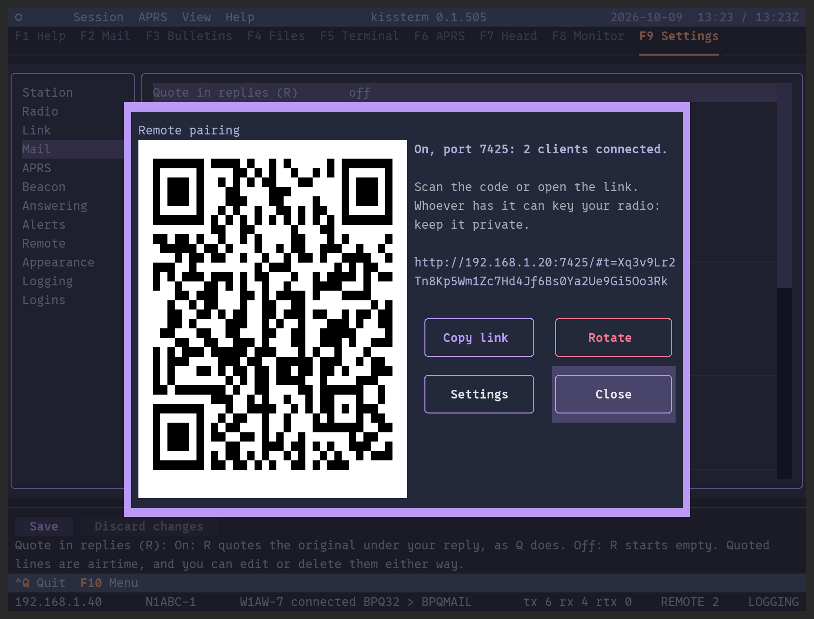

- **The link is the key.** Whoever holds it can key your radio under
  your callsign, as you can at the keyboard. It is the same every launch,
  so a bookmark keeps working, and different on every machine. Rotate
  (in the pairing dialog, after a confirmation) or `kissterm
  --rotate-token` replaces it: the old link stops working and every
  connected client is dropped.
- **The same rules as the keyboard.** A remote connect still shows the
  radio reminder and arms the transmit switch visibly; a beacon still
  refuses while transmit is off; nothing transmits at startup. Every
  notice goes to every client. A question (the radio reminder, a missing
  login) goes to every client, and to this screen when remote control
  runs inside the terminal; the first answer wins and the others close.
  Headless with no client connected, it is cancelled, and a cancelled
  request sends nothing.
- **The remote control** (needs the `web` extra on the station, SETUP.md
  section 11) is laid out for a phone: five places along the bottom
  (Mail, Messages, Terminal, Stations, More; it opens on Mail), or down
  the side on a wide screen (where Mail's Bulletins and Files get a
  place each), and the transmit switch always in the top corner, red
  with "TX ON" while transmit is on. Tapping it while on turns transmit off at
  once; turning it on asks first. In a browser's menu, "Add to Home
  screen" or "Install app" keeps it as an app. The link's key is kept by
  that browser and taken out of the address bar, so a screenshot of the
  page does not show it.
  Coming back to the page after the phone slept or the tab sat in the
  background starts it afresh: it reconnects to the station and shows
  where things stand, so a moment's blank screen there is expected. If
  the browser is slow to hand back the kept key, the page says so with
  **Try again** (and tries again itself when it comes to the front).
  - **Mail** has three sections, as the terminal has three tabs: **Mail**
    (titled BBS Mail), **Bulletins** and **Files**, switched at the top of
    the page (on a wide screen, each is its own place at the side). The
    folder row under the switch shows where you are ("BBS / Inbox"); tap
    it and a tree opens under it, as wide as the switch: tap BBS or
    Winlink to fold its folders open or shut, tap a folder to go there.
    The tree holds that section's folders only, and each section opens
    where you left it. Mail opens on **All Inboxes**,
    BBS and Winlink together as on the terminal's Mail tab, each message
    marked with the service it came by. Its button asks first
    and does what G and I do on the terminal's tabs: on a mail folder,
    Send/Receive **By radio** or **By Internet** (no transmitting); on a
    Bulletins folder, Get bulletins either way; on Files, Get files by
    radio, which then asks here which files to download. On a Bulletins
    folder, **Categories** (S in the terminal) ticks which categories Get
    bulletins collects, from the list the Home BBS gave last; nothing is
    asked of the BBS to change it.
    A Files folder lists its files, newest first, with each one's size
    and date. Tapping one shows what the terminal's reader shows before
    Enter: a zip's contents, the start of a text file, or that a file is
    not text. The **Open** button (Enter in the terminal) shows a zip's
    files as a list, a tap opening one a level deeper (a zip in a zip
    too), Markdown and HTML formatted, and other text; links are shown
    and never followed, images are never loaded, and nothing in the file
    runs. A PKTNET form page has **Fill in** (Enter in the terminal), which
    opens that form. **Send over the radio** (S in the terminal) sends the file by
    YAPP or AutoBIN over a connected session after asking (a file on the
    phone is first added with **Add file**, on any Files folder, which
    keeps it in Files > Uploads, up to 1 MiB, and sends nothing); it is experimental until tried on the air. Delete and swipe
    work as on messages.
    A message from a BBS has one small **Routing** line under the date,
    an arrow that unfolds; tap it
    for the `R:` line each BBS added, the latest first. A number@BBS there is that BBS's message number,
    not the sender's address.
    While a run is going its button turns and the progress line
    ("Receiving 2 of 2") counts dots; tap the turning button to cancel
    the run, which disconnects without asking.
    **Write** (the small pencil above the Send/Receive button, on a Mail
    folder, both against the screen's right edge) writes a private
    BBS message, a bulletin or a Winlink message; **Save to Outbox** files
    it, with the same checks as the terminal (a To without an SSID, a
    title, nothing that ends the text early), and sends nothing until
    Send/Receive. The reader has **Reply**, **Reply all** (only when the
    message went to others too), **Reply with quote** and **Delete**
    (Restore in Deleted). **Swipe a message** either way to delete it
    (or, in Deleted, to restore it): it goes once the row is dragged
    halfway, and sliding it back before letting go cancels. **Undo** on
    the note that follows puts it back. **Radiograms** are written here
    too: choose **NTS radiogram (ST)** or **Radiogram-ICS213 (ST)** as a
    new message's Type for the radiogram form, with the terminal's rules.
    The text converts as you type (a period becomes X), and the check,
    the `ST <zip> @ NTS<state>` routing and the title follow every change.
    Save to Outbox files it; Send/Receive sends it. **Forms** (ICS-213,
    ICS-205, ICS-214, ICS-309 with its **Fill from mail**, the Winlink
    check-in, damage assessment, severe weather and the rest, "(form)" in
    the Type list) open on their own page, laid out as the terminal's are;
    **Next** checks the form and opens the writer with its text, title and
    To filled in, to be addressed and saved. A Winlink message carries the
    form's XML unless you change the text after the form. Reading a
    message that is a form with a reply form (the ICS-213) offers **Reply
    on form** (its blocks read-only above yours), and one carrying an
    information strip offers **Answer strip**; both open the form, and Next
    writes the reply addressed as any reply. **Information strip (paste)**
    in the Type list takes a pasted strip and goes on to its questions.
  - **Messages** (titled APRS messages) is APRS as conversations, in
    bubbles, with a new message limited to the 67 characters APRS
    carries. **Templates**, beside the message box in a conversation (the
    terminal's `Ctrl+R`), lists what to say to that gateway, with how far
    to trust each line, and your saved messages (New, edit, forget); a
    choice fills the message box and nothing is sent until Send.
    **Position** above the conversations sends one
    position report (APRS > Send position in the terminal), after asking.
    **Map** beside it shows the APRS map (APRS > Map in the terminal):
    drag to pan, pinch or the mouse wheel to zoom, + and - and a button
    to show everything again, and a tap on a point for what it reported,
    how far and which way, when it was heard and its comment, with
    **Message** to open a conversation with a station. It refreshes as
    stations are heard. A **long press** on the map opens an object
    report for that spot, and **Object** beside Map one for where you
    are (APRS > Object in the terminal): a name, the place (decimal
    degrees, a grid square, MGRS or WGS-84 UTM, converted by the
    station), a symbol, a comment and where it goes, sent by Send after asking. Your objects
    show at once; tap one for **Move** (then a long press where it goes)
    and **Kill** (after asking).
  - **Terminal** (once called Sessions) is the terminal: one page per session, swiped or tapped
    across the top, and a line to type. A line goes only when you press
    Send. Connect is at the end of the session tabs; **Disconnect** sits
    beside the transmit switch while the session shown is connected.
    Both ask first. Once a session has dropped, **Reconnect** takes
    Disconnect's place (Ctrl+R in the terminal): after asking, the
    station dials it again the same way, route, port and login.
    The **Commands** button (a book, beside the line; F1 in the terminal)
    lists what the node or BBS in effect understands, with each line's
    source and whether it needs the sysop, a **Glossary** of packet terms,
    and a search; a choice fills the line and nothing is sent. As you
    type, matching commands appear over the line (the terminal's
    suggestion strip); tap one to fill it. **Learn from node** asks the
    node for its own list, once, after showing its airtime, and **Forget
    learned** drops it. **Receive file** starts receiving one by AutoBIN
    or YAPP, after asking; it is saved in Files > Downloads.
    A connect brings Terminal to the front at once: while
    the station is calling, an hourglass shows over the session with
    **Cancel**, which stops the attempt without asking (it only stops
    transmitting).
  - **Stations** has Contacts and Heard, swiped between. **A swipe never
    transmits**: swiping a station right asks "Connect to ...?", swiping
    it left opens its contact, and nothing happens until that sheet's
    own button is pressed. Tapping a station asks to connect too.
    **RMS gateways**, the first row of Contacts (F10 > Session in the
    terminal), lists the saved Winlink gateways nearest first, by mode;
    choosing one, after asking, puts it in the Address Book as the Winlink
    Dial and sends nothing. **Refresh** fetches the list from winlink.org
    over the Internet and waits on kissterm's Winlink API key.
  - **More** shows the station (with **Send beacon**, which asks which:
    **Packet beacon** sends the beacon text once, as Session > Send
    beacon does, and needs transmit already on; **APRS position** sends
    one position report, as APRS > Send position does, and **Restart
    station** and **Shut down**, which ask first: see Restart above),
    the Monitor (a filter box for a callsign or text, a port picker and
    switches for Supervisory, Unnumbered, Information and UI frames, kept
    on this device), **Transcripts** (past sessions, newest first, searched
    by callsign or by what was said, and read in the terminal's look), recent notices, Terminal,
    and Settings (the station's own, checked by the station as the
    terminal checks them; a password field left empty keeps the saved
    one). **Terminal** sets how session text looks on this phone or
    browser only: a dark panel (the default) or a light one for
    sunlight, and the text colour (Grey, Contrast, Green, Amber or Cyan),
    with a sample.
  - A **question** (the radio reminder, a login) slides up from the
    bottom. Swiping it away is Cancel.
  - `kissterm --client LINK` opens the same remote control in a window
    on a desktop (the `desktop` extra). It has not been tried on a
    desktop yet.
- **Not the remote control: `kissterm --web-terminal`** (experimental)
  puts this terminal UI itself on a web page, keys and all, through
  Textual's `textual-serve` (the `webterm` extra). **It has no pairing
  link and no login**: anyone who can open its address can key the
  radio, and it says so when it starts. It listens on
  `127.0.0.1:8765` unless given an address (`--web-terminal
  0.0.0.0:8765` opens it to the network, and the warning says so too).
  For a browser or a phone, the remote control above is the way.

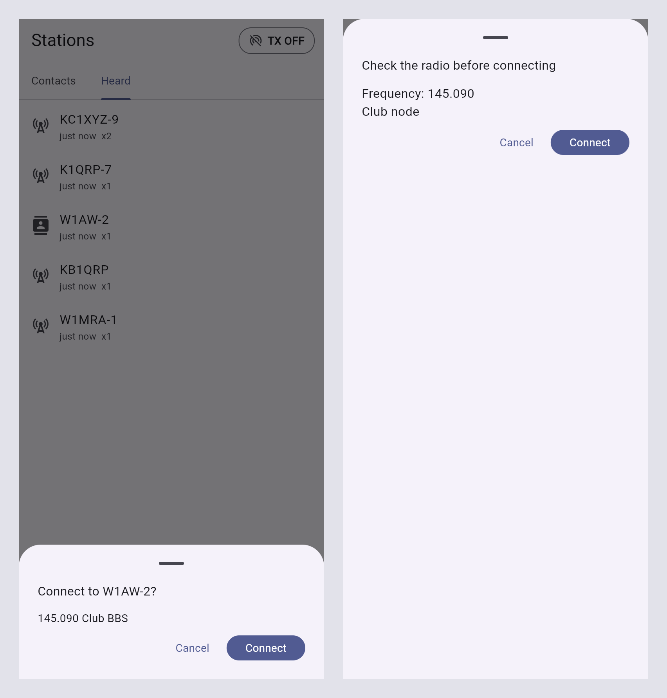

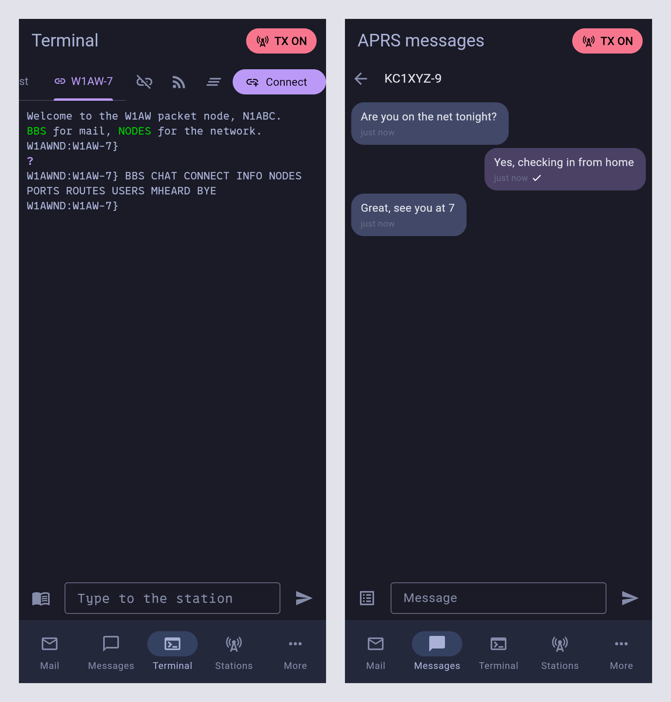

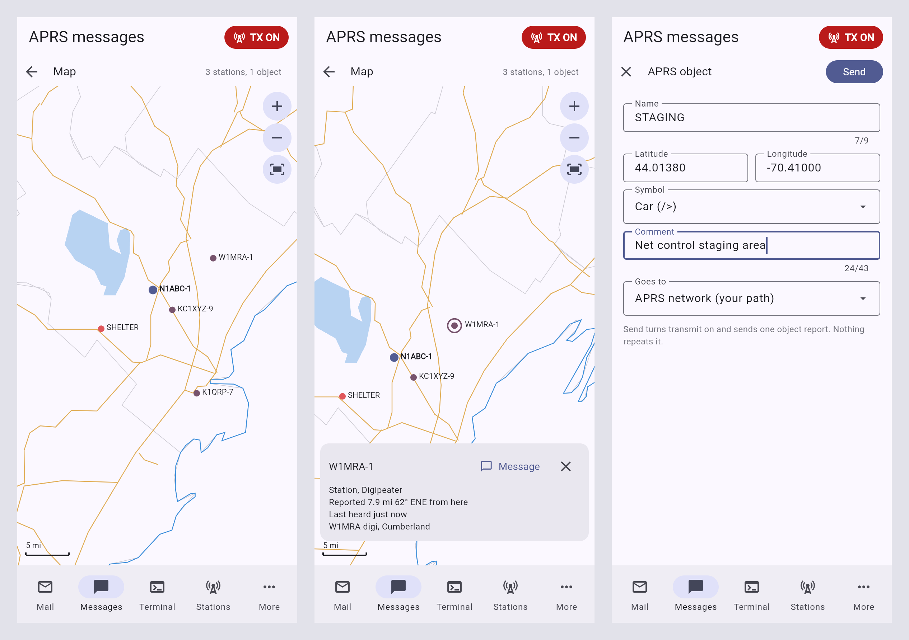

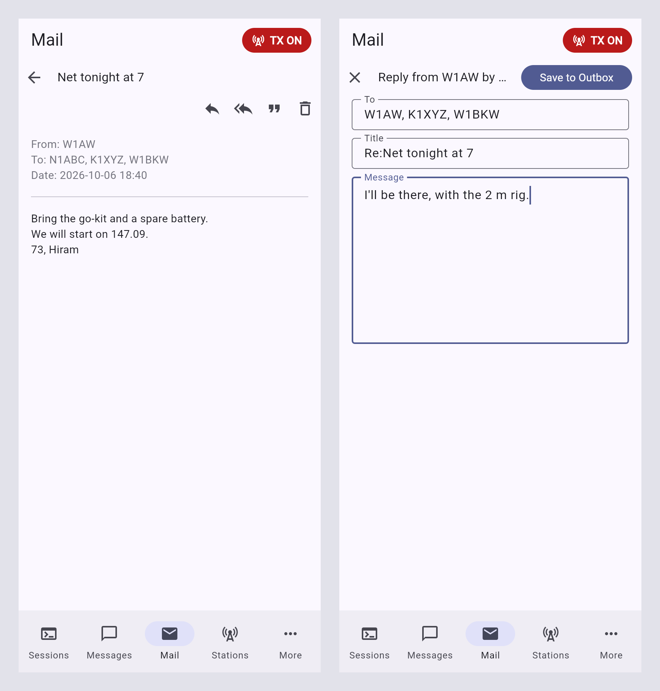

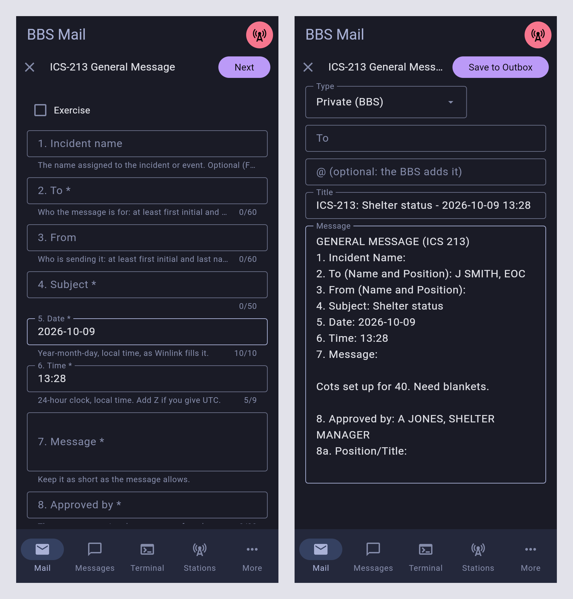

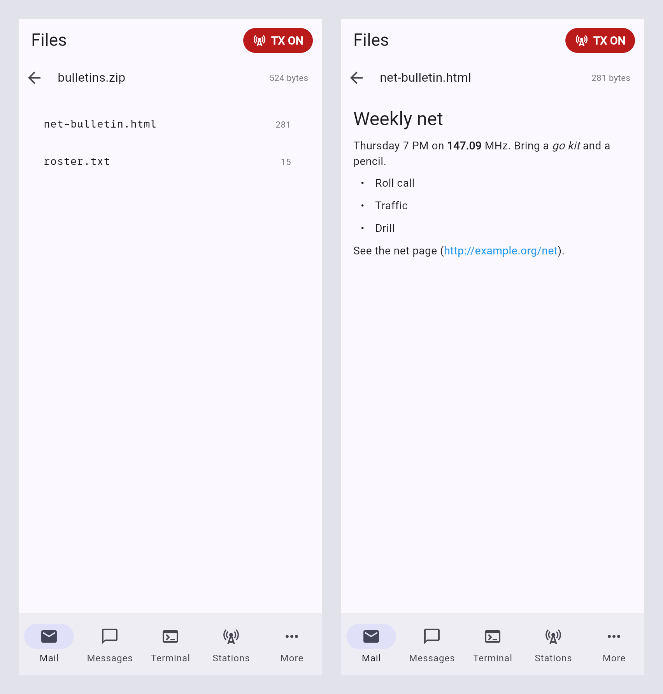

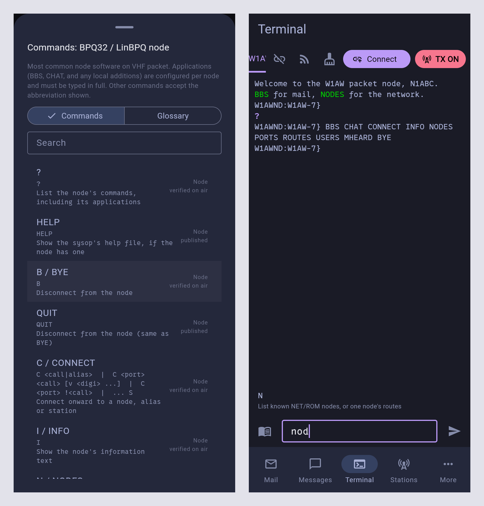

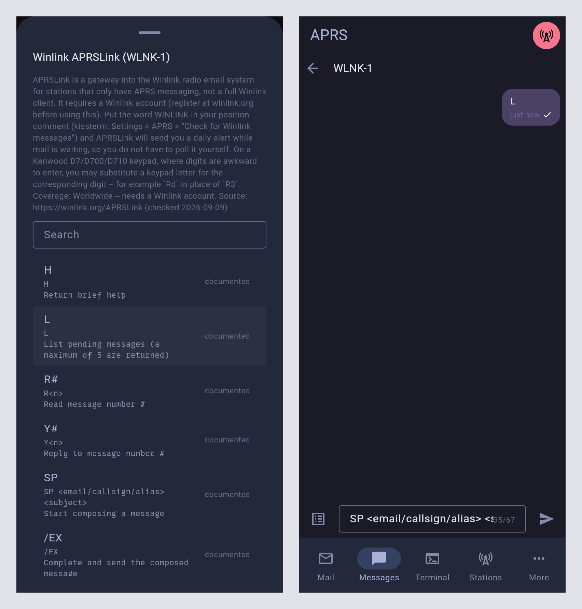

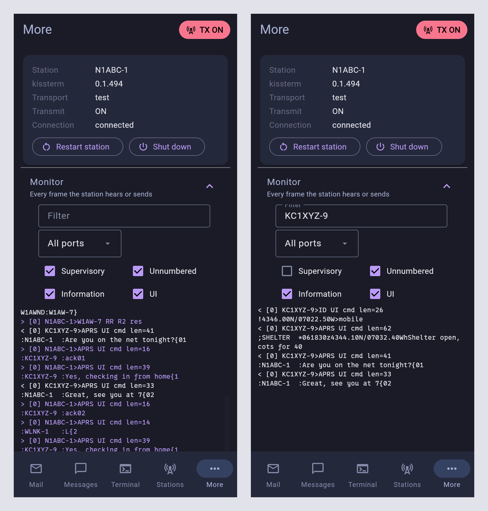

On a wider screen (a laptop's browser, a tablet) the places run down the
side:

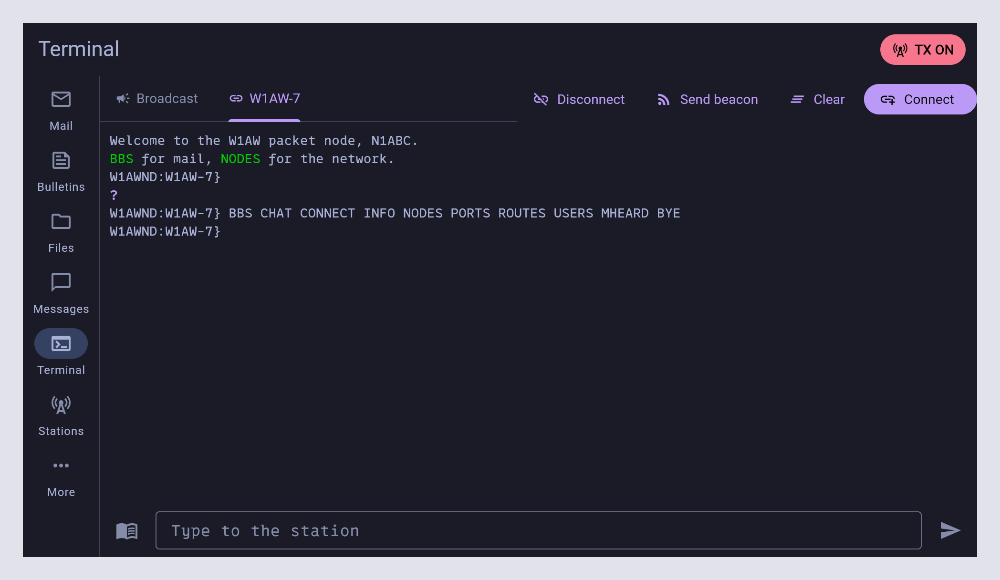

- **Settings > Remote** sets the port (7425), whether it listens on the
  LAN or on this machine only, and, under advanced, a **Public URL** for
  a reverse proxy that adds HTTPS, or a certificate and key for kissterm
  to serve `wss://` itself. Plain `ws://` is for a LAN you trust or a VPN
  such as Tailscale: without TLS the link crosses the network readable.

## Command line

```
kissterm                     launch
kissterm --doctor            run diagnostics and exit
kissterm --discover          scan for TNCs and modems, print, exit
kissterm --callsign W1AW-1   set your callsign and exit (no wizard)
kissterm --setup             re-run the first-run wizard
kissterm --transport NAME    open a specific configured transport
kissterm --connect WS1EC-7   connect once the app is up
kissterm --log-level debug   record every frame, both directions, to a file
kissterm --no-update-check   do not look on GitHub for a newer version
kissterm --serve             run with no screen, for remote clients (experimental)
kissterm --rotate-token      replace the remote pairing link and print the new one
kissterm --client LINK       open a station's remote control in a window (experimental)
kissterm --web-terminal      this terminal UI in a browser, NO login (experimental)
```

**Updates.** Once a day kissterm asks GitHub, over the Internet, whether a
newer version exists, and says so once in a pop-up notice. It never installs anything on its own:
F10 > Help > Check for updates offers **Update**, which shows the command
first (`pipx upgrade kissterm` or `uv tool upgrade kissterm`) and is not
offered while a session is connected, a connect is under way or
Send/Receive is running. Restart kissterm afterwards to use the new
version (F10 > Session > Restart kissterm, or Restart station on the
phone's More). A source checkout is told to `git pull`. Settings > Station >
Check for updates turns the daily check off.

`kissterm --doctor` diagnoses what usually goes wrong: serial
permissions, missing dependencies, an unreachable TNC host, a bad
callsign. Attach its output to a bug report.

## Why kissterm exists

Packet radio on Linux has meant a hard choice: `linpac`, which needs the
kernel AX.25 stack configured as root and cannot reach a KISS TNC over the
network, or a Windows program such as BPQTerminal or UZ7HO EasyTerm.

kissterm implements **AX.25 connected mode itself, in user code, over
KISS**. That one decision lets it run without special privileges, on any
platform, against a sound-card modem (UZ7HO SoundModem, or Direwolf on a
Raspberry Pi in the garage), and (once
proven on hardware; ROADMAP P3) a TNC on a USB cable or a Bluetooth TNC in
your pocket.

| | kissterm | linpac | BPQTerminal | EasyTerm |
|---|---|---|---|---|
| KISS over serial | experimental | via kernel | yes | yes |
| KISS over TCP/IP | **yes** | no | yes | yes |
| Bluetooth TNC | experimental | via kernel | no | no |
| Needs kernel AX.25 | **no** | yes | no | no |
| Needs root to set up | **no** | yes | no | no |
| Runs on Linux / macOS | **yes** | Linux | no | no |
| Terminal UI (works over SSH) | **yes** | yes | no | no |
| APRS decode | yes | no | no | separate app |
